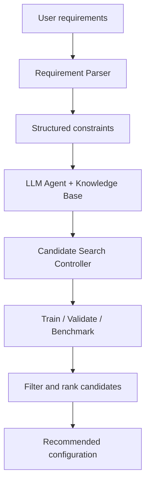

# EdgeNAS-Lite

EdgeNAS-Lite is a lightweight, LLM-guided prototype for selecting and evaluating hardware-aware YOLO configurations.

Given user-defined constraints such as minimum accuracy, maximum latency, and maximum model size, the planned system will generate candidate configurations, validate them, benchmark them on the target device, and rank the feasible candidates using multi-objective criteria.

> **Current scope:** the implemented work covers reproducible YOLO training, validation, CPU benchmarking, structured experiment configurations, and machine-readable results. The Requirement Parser, knowledge base, LLM agent, candidate controller, and automated ranking pipeline are still under development.

## Why this project?

Deploying an object detector on edge hardware is not only an accuracy problem. A model must also satisfy practical limits such as inference latency, memory footprint, model size, and available compute.

EdgeNAS-Lite explores this trade-off with a resource-conscious workflow suitable for a personal portfolio project. It focuses initially on configuration search rather than expensive architecture-level neural architecture search.

## Project objectives

- Convert natural-language deployment requirements into validated YAML or JSON constraints.
- Retrieve verified model, training, export, and hardware information.
- Use an LLM agent to propose candidates inside a predefined search space.
- Train or validate candidate YOLO models reproducibly.
- Benchmark candidates on the actual target device.
- Filter candidates that violate hard constraints.
- Rank feasible candidates using accuracy, latency, and model-size metrics.
- Produce human-readable reports and machine-readable result files.

## System design



### Planned modules

1. **Requirement Parser** — converts natural-language requests into validated constraints.
2. **Knowledge Database** — stores verified model, hardware, deployment, and experiment information.
3. **LLM Agent** — recommends candidate configurations within an allowed search space.
4. **Search Controller** — coordinates candidate generation, training, validation, benchmarking, filtering, and ranking.
5. **Evaluation** — reports accuracy, latency, throughput, parameter count, model size, and constraint satisfaction.

## Current progress

### Completed

- [x] Python virtual environment and dependency setup
- [x] Ultralytics installation
- [x] YOLO26 inference smoke test
- [x] Initial modular project structure
- [x] CPU latency microbenchmark with JSON output
- [x] KITTI dataset preparation through the Ultralytics dataset definition
- [x] Three-class KITTI training pipeline
- [x] One-epoch training smoke test
- [x] Ten-epoch pilot training experiment
- [x] Full KITTI validation for the pilot model
- [x] CPU validation of the trained `best.pt` checkpoint
- [x] Reusable YAML experiment configurations

### In development

- [ ] Standardized CPU benchmark for every trained candidate
- [ ] Combined accuracy, latency, and model-size candidate records
- [ ] Requirement Parser
- [ ] Knowledge Database
- [ ] LLM Agent
- [ ] Candidate Search Controller
- [ ] Constraint filtering and multi-objective ranking
- [ ] Evaluation dashboard

## Experimental setup

| Component | Value |
|---|---|
| Task | 2D object detection |
| Model family | Ultralytics YOLO26 |
| Starting checkpoint | `yolo26n.pt` |
| Dataset | KITTI 2D Object Detection |
| Selected classes | Car, Pedestrian, Cyclist |
| Class IDs | `0`, `3`, `5` |
| Training hardware | Apple M2 using MPS |
| Deployment target | Local CPU |
| Input size | 640 × 640 |
| Python | 3.9.6 |
| PyTorch | 2.8.0 |
| Ultralytics | 8.4.123 |
| Platform | macOS ARM64 |

The dataset and pretrained weights are not stored in this repository. Ultralytics downloads the resources referenced by `kitti.yaml` when the dataset is first used. Users remain responsible for complying with the relevant dataset and model licenses.

## Results

### 1. Pretrained CPU latency baseline

The first benchmark measures the original `yolo26n.pt` checkpoint on a local CPU using one sample image.

| Setting | Value |
|---|---:|
| Image size | 640 |
| Warm-up runs | 5 |
| Timed runs | 30 |
| Parameters | 2.409 M |
| Model size | 5.288 MB |
| Median latency | 31.455 ms |
| Average latency | 31.887 ms |
| Throughput | 31.792 FPS |

The measurements can vary slightly between runs because of CPU load, thermal state, and background processes. This benchmark is a latency reference, not an accuracy evaluation.

Output:

```text
results/baseline_benchmark.json
```

### 2. KITTI pipeline smoke test

The smoke test trained `yolo26n.pt` for one epoch using 10% of the KITTI training split. Its purpose was to verify dataset loading, label parsing, class filtering, MPS training, validation, and artifact generation.

| Setting | Value |
|---|---:|
| Epochs | 1 |
| Training fraction | 10% |
| Batch size | 4 |
| Validation images | 1,496 |
| Validation instances | 6,989 |

| Class | Precision | Recall | mAP@0.5 | mAP@0.5:0.95 |
|---|---:|---:|---:|---:|
| All | 0.220 | 0.219 | 0.162 | 0.0776 |
| Car | 0.392 | 0.445 | 0.375 | 0.202 |
| Pedestrian | 0.219 | 0.210 | 0.107 | 0.0296 |
| Cyclist | 0.0506 | 0.00284 | 0.00401 | 0.000973 |

The low accuracy is expected because this experiment used only one epoch and 10% of the training data. It is reported as a technical pipeline check, not as the final model result.

### 3. KITTI pilot experiment

The pilot model was trained for ten epochs using 25% of the KITTI training split and evaluated on the complete validation split.

| Setting | Value |
|---|---:|
| Epochs | 10 |
| Training fraction | 25% |
| Batch size | 4 |
| Training device | Apple M2 MPS |
| Validation images | 1,496 |
| Validation instances | 6,989 |

#### Overall accuracy

| Precision | Recall | mAP@0.5 | mAP@0.5:0.95 |
|---:|---:|---:|---:|
| 0.527 | 0.488 | 0.485 | 0.273 |

#### Per-class accuracy

| Class | Precision | Recall | mAP@0.5 | mAP@0.5:0.95 |
|---|---:|---:|---:|---:|
| Car | 0.670 | 0.756 | 0.779 | 0.516 |
| Pedestrian | 0.468 | 0.475 | 0.432 | 0.198 |
| Cyclist | 0.443 | 0.233 | 0.244 | 0.106 |

#### Improvement over the smoke test

| Metric | Smoke test | Pilot | Absolute change |
|---|---:|---:|---:|
| Precision | 0.220 | 0.527 | +0.307 |
| Recall | 0.219 | 0.488 | +0.269 |
| mAP@0.5 | 0.162 | 0.485 | +0.323 |
| mAP@0.5:0.95 | 0.0776 | 0.273 | +0.1954 |

Training and validation losses decreased across the ten epochs while recall and both mAP metrics increased. No clear overfitting was observed during this short pilot.

`Cyclist` remains the most difficult class, particularly in recall. This provides a useful optimization target for later candidate experiments involving image resolution, training fraction, augmentation, and model scale.

### 4. Validation speed

The same pilot checkpoint was validated on MPS and CPU. Accuracy remains unchanged because both runs use the same weights and validation split, but execution speed depends on the hardware and measurement protocol.

| Device | Preprocess | Inference | Postprocess | Notes |
|---|---:|---:|---:|---|
| Apple M2 MPS | 3.0 ms/image | 8.7 ms/image | 1.9 ms/image | Reported after pilot training |
| Local CPU | 0.1 ms/image | 17.0 ms/image | 0.0 ms/image | Batch size 1, full validation split |

The CPU validation processed 1,496 images in approximately 29.6 seconds, or 50.6 iterations per second.

> The Ultralytics validation speed and the custom `time.perf_counter()` microbenchmark use different pipelines. Their latency values should not be compared as if they were produced by the same benchmark protocol.

## Repository structure

```text
EdgeNAS-Lite/
├── configs/
│   ├── project_spec.yaml
│   ├── kitti_smoke.yaml
│   ├── kitti_pilot.yaml
│   └── kitti_val_cpu.yaml
├── data/
├── knowledge/
├── models/
├── notebooks/
├── results/
│   ├── baseline_benchmark.json
│   └── pilot_cpu_benchmark.json
├── src/
│   ├── evaluation/
│   │   └── benchmark.py
│   ├── knowledge_database/
│   ├── llm_agent/
│   ├── nas_controller/
│   └── requirement_parser/
├── .gitignore
├── README.md
├── requirements.txt
└── smoke_test.py
```

Generated datasets, virtual environments, large model weights, and complete experiment directories should remain outside version control. Selected plots and small result files can be copied into a dedicated `artifacts/` directory for portfolio presentation.

## Installation

### 1. Clone the repository

```bash
git clone <YOUR_REPOSITORY_URL>
cd EdgeNAS-Lite
```

Replace `<YOUR_REPOSITORY_URL>` with the GitHub repository URL after publishing the project.

### 2. Create a virtual environment

```bash
python3 -m venv .venv
source .venv/bin/activate
```

On Windows PowerShell:

```powershell
python -m venv .venv
.venv\Scripts\Activate.ps1
```

### 3. Install dependencies

```bash
python -m pip install --upgrade pip
pip install -r requirements.txt
```

### 4. Verify the installation

```bash
python -c "import torch, ultralytics; print('Torch:', torch.__version__); print('Ultralytics:', ultralytics.__version__)"
```

## Running the experiments

Run all commands from the repository root.

### Inference smoke test

```bash
python smoke_test.py
```

### KITTI training smoke test

Apple Silicon:

```bash
yolo detect train cfg=configs/kitti_smoke.yaml device=mps
```

CUDA GPU:

```bash
yolo detect train cfg=configs/kitti_smoke.yaml device=0
```

CPU:

```bash
yolo detect train cfg=configs/kitti_smoke.yaml device=cpu
```

The first KITTI command may download and prepare the dataset automatically.

### KITTI pilot training

```bash
yolo detect train cfg=configs/kitti_pilot.yaml device=mps
```

Expected checkpoint:

```text
runs/detect/kitti_yolo26n_pilot/weights/best.pt
```

### Validate the pilot checkpoint on CPU

```bash
yolo detect val cfg=configs/kitti_val_cpu.yaml
```

Expected validation output:

```text
runs/val/kitti_yolo26n_pilot/
```

### Run the custom CPU latency benchmark

```bash
python src/evaluation/benchmark.py
```

Use separate output files for separate candidates:

```text
results/baseline_benchmark.json
results/pilot_cpu_benchmark.json
```

Do not use `baseline_benchmark.json` as the output path when benchmarking the trained pilot checkpoint, because doing so will overwrite the baseline result.

For the pilot benchmark, the script should point to:

```python
MODEL_PATH = (
    PROJECT_ROOT
    / "runs"
    / "detect"
    / "kitti_yolo26n_pilot"
    / "weights"
    / "best.pt"
)

RESULT_PATH = PROJECT_ROOT / "results" / "pilot_cpu_benchmark.json"
```

## Experiment configurations

The project keeps concise, human-authored configs in `configs/`. The much longer `args.yaml` file inside each Ultralytics run directory is generated automatically and records all resolved defaults.

| File | Purpose |
|---|---|
| `configs/project_spec.yaml` | Project objectives, target hardware, metrics, and constraints |
| `configs/kitti_smoke.yaml` | One-epoch, 10% pipeline test |
| `configs/kitti_pilot.yaml` | Ten-epoch, 25% pilot experiment |
| `configs/kitti_val_cpu.yaml` | Full validation of the pilot checkpoint on CPU |
| `runs/**/args.yaml` | Complete configuration automatically recorded by Ultralytics |

Recommended output settings for training configs:

```yaml
project: runs/detect
name: kitti_yolo26n_pilot
exist_ok: false
```

Using `project` and `name` consistently prevents accidental nested paths such as `runs/detect/runs/detect/...`.

## Metrics

- **Precision:** the proportion of predicted detections that are correct.
- **Recall:** the proportion of ground-truth objects detected by the model.
- **mAP@0.5:** mean Average Precision at an IoU threshold of 0.5.
- **mAP@0.5:0.95:** mean Average Precision averaged across IoU thresholds from 0.5 to 0.95.
- **Latency:** time required to process one input under a defined benchmark protocol.
- **Throughput:** number of inputs processed per second.
- **Model size:** checkpoint size on disk; this is different from runtime memory usage.

## Candidate search space

The first automated version will search a small, validated space:

- YOLO model scale
- Input resolution
- Training fraction and number of epochs
- Batch size
- Confidence and IoU thresholds
- Export format
- Quantization mode

Architecture mutation, large-scale weight sharing, and distributed NAS are outside the first version's scope.

## Planned candidate record

Each evaluated candidate will eventually produce a combined JSON record similar to:

```json
{
  "candidate_id": "yolo26n_kitti_pilot",
  "model": "best.pt",
  "dataset": "KITTI",
  "device": "cpu",
  "imgsz": 640,
  "precision": 0.527,
  "recall": 0.488,
  "map50": 0.485,
  "map50_95": 0.273,
  "latency_ms": null,
  "model_size_mb": null,
  "constraints_satisfied": null
}
```

`null` values are filled only after the corresponding standardized benchmark or constraint evaluation has completed.

## Limitations

- The current pilot uses only 25% of the KITTI training split and ten epochs.
- The custom latency microbenchmark currently uses a single sample image.
- The baseline and validation speed measurements use different protocols.
- Latency results are specific to the tested hardware and software environment.
- `Cyclist` performance remains substantially lower than `Car` performance.
- The current implementation performs configuration search, not full neural architecture mutation.
- LLM-generated candidates will be schema-validated before any command is executed.
- The automated Requirement Parser, LLM agent, controller, and ranking pipeline are not yet complete.

## Portfolio artifacts

The public portfolio version should emphasize reproducibility and results rather than raw terminal history. Recommended artifacts include:

- concise YAML experiment configs;
- source code for training, validation, and benchmarking;
- benchmark JSON files;
- `results.png` learning curves;
- confusion matrices;
- selected validation predictions;
- a compact comparison table;
- limitations and the next development steps.

Do not publish `.venv/`, downloaded datasets, API keys, all generated runs, or large model weights directly in the repository.

## Roadmap

1. Standardize the CPU latency benchmark using representative KITTI validation images.
2. Record median, mean, standard deviation, p95 latency, and throughput.
3. Merge accuracy, latency, parameter count, and model size into one candidate record.
4. Implement the Requirement Parser and schema validation.
5. Build the verified model and hardware knowledge base.
6. Implement bounded LLM candidate generation.
7. Add constraint filtering and multi-objective ranking.
8. Compare multiple resolutions and YOLO model scales.
9. Build a small evaluation dashboard.

## Reproducibility notes

- Run commands from the repository root.
- Keep the random seed fixed when comparing candidates.
- Record the model path, dataset split, device, image size, batch size, software versions, and benchmark protocol.
- Do not compare latency measurements produced by different devices or protocols as if they were directly equivalent.
- Preserve each experiment's config, selected artifacts, and machine-readable result file.

## References

- [Ultralytics YOLO26](https://docs.ultralytics.com/models/yolo26/)
- [Ultralytics Train Mode](https://docs.ultralytics.com/modes/train/)
- [Ultralytics Validation Mode](https://docs.ultralytics.com/modes/val/)
- [Ultralytics Predict Mode](https://docs.ultralytics.com/modes/predict/)
- [Ultralytics Performance Metrics](https://docs.ultralytics.com/guides/yolo-performance-metrics/)
- [Python `time.perf_counter`](https://docs.python.org/3/library/time.html#time.perf_counter)
- [PyTorch `torch.numel`](https://docs.pytorch.org/docs/stable/generated/torch.numel.html)

## Acknowledgements

Core orchestration and evaluation code for EdgeNAS-Lite is developed as original portfolio work. Ultralytics YOLO, pretrained weights, KITTI data, official APIs, documentation, and any externally adapted implementations remain credited to their respective authors and licenses.

