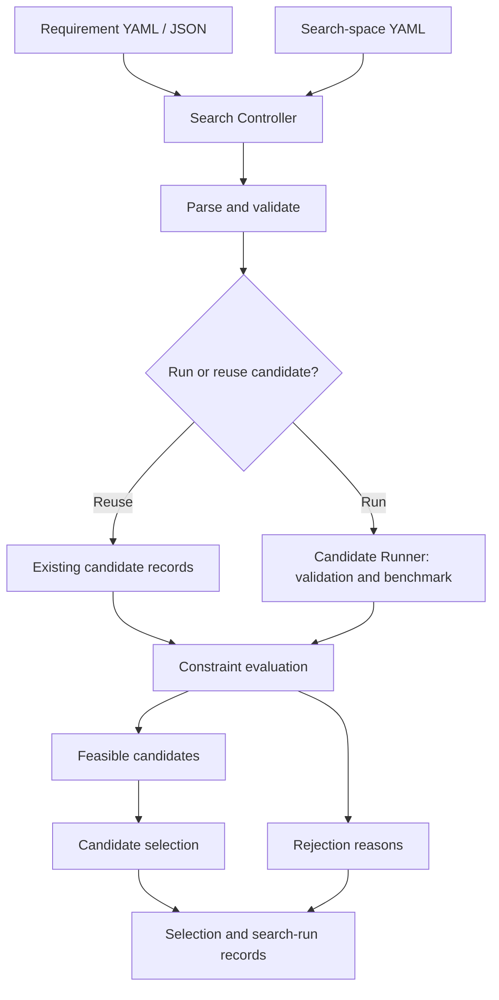
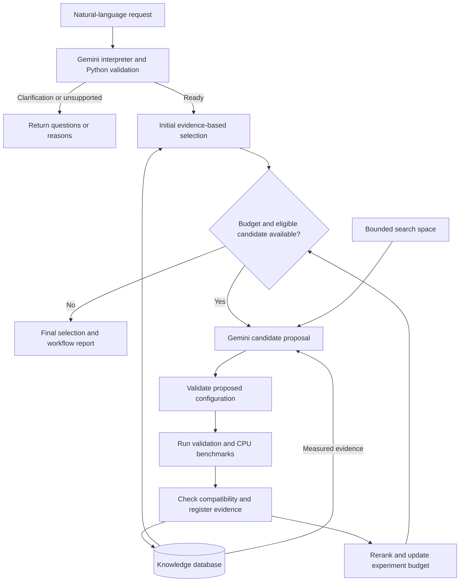
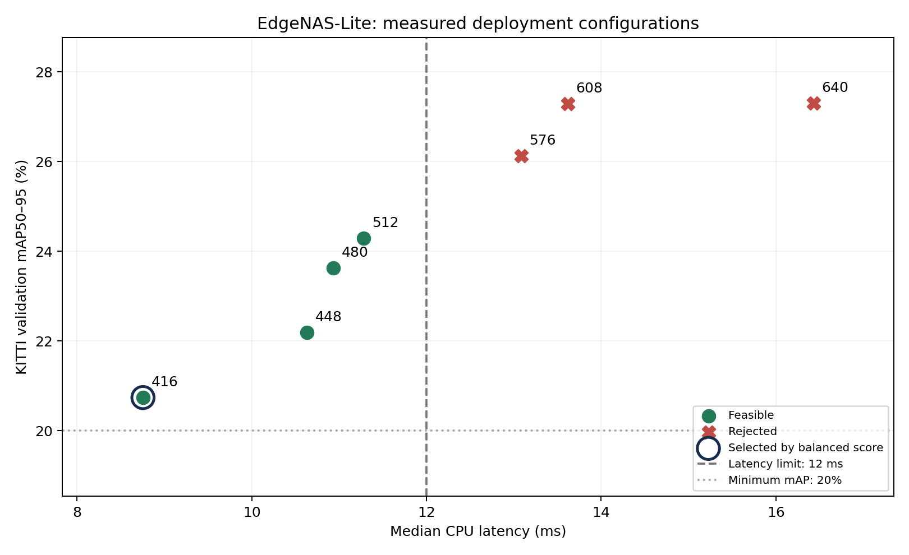

# EdgeNAS-Lite

**LLM-guided, hardware-aware YOLO deployment-configuration search.**

[System design](#system-design) · [Results](#final-pilot-result) · [Evidence](#validation-and-evidence) · [Setup and usage](SETUP_AND_USAGE.md)

## What is EdgeNAS-Lite?

Choosing an object detector for deployment involves competing requirements: sufficient detection accuracy, acceptable inference latency, and a model that fits the storage budget. A configuration with higher accuracy may exceed the latency limit, while a faster configuration may miss the accuracy target. EdgeNAS-Lite makes this trade-off explicit and selects a configuration using measured evidence.

The project is intended for developers exploring how to turn deployment requirements into an auditable model-configuration decision. It combines an LLM interface with a conventional evaluation pipeline so that a request can be traced to concrete measurements and a repeatable selection rule.

A user supplies requirements in natural language or structured YAML/JSON. The system checks those requirements, retrieves compatible candidate measurements, optionally runs additional experiments within a budget, and ranks the candidates that satisfy every hard constraint. The output includes the selected configuration, measured metrics, ranking, and reasons for rejecting alternatives.

Gemini provides the language interface and proposes which eligible configuration to evaluate next. Python implements validation, experiment execution, compatibility checks, and the final selection policy. Accuracy and latency come from model evaluation and benchmarks; they are not generated by the LLM.

The current prototype studies **one trained YOLO26n checkpoint, KITTI, CPU deployment, and seven input resolutions: 416, 448, 480, 512, 576, 608, and 640**. A candidate is the checkpoint evaluated at a particular input resolution, with no retraining between candidates. This is a bounded deployment-configuration search prototype; architecture-level neural architecture search is outside the implemented scope.

## What the system delivers

- **Requirement interpretation:** convert natural language into validated constraints, or return clarification questions for incomplete or conflicting requirements.
- **Evidence reuse:** retrieve stored measurements and check selected protocol metadata and target hardware identity before selection.
- **Budgeted exploration:** propose an unmeasured resolution from the allowed pool, execute validation and CPU benchmarks, and register the resulting evidence.
- **Constraint-based selection:** enforce accuracy, median-latency, and model-size limits, then rank feasible candidates according to the requested optimization goal.
- **Traceable results:** retain candidate metrics, benchmark samples, proposal rationale, and selection reports for inspection.

## System design

The system has two orchestration paths that use the same underlying ideas: validate inputs, run or reuse measurements, enforce constraints, select a candidate, and preserve the evidence. The structured Search Controller and the LLM workflow are separate entry points.

### 1. Structured search pipeline

Requirement YAML/JSON defines the target and constraints. Search-space YAML defines the fixed model and dataset settings, allowed resolutions, and experiment budget.

The controller enforces hard constraints before ranking. A run with no feasible candidate produces a no-selection result with the available evaluation evidence. The structured proposal CLI also supports selection directly from the knowledge database, without a Gemini call.

### 2. Natural-language workflow and experiment loop

Gemini interprets the request; Python validates the interpretation. The workflow first selects from compatible stored evidence, then optionally explores new configurations through the Budget and Experiment Controllers.

The second diagram shows the successful experiment path. Invalid proposals or execution failures are reported; they are not treated as successful measurements. The workflow stops for clarification and requires a new request rather than continuing an interactive conversation.

**Responsibility boundary:** Gemini interprets intent and proposes an allowed experiment. Python checks eligibility, performs measurements, enforces constraints, and determines the final ranking. The LLM does not supply benchmark values or override failed constraints.

All seven resolutions are already measured in the current index. Changing a request can change the selected candidate, but a positive budget does not force new measurements when the pool is exhausted.

### Main components

| Component | Role | Implementation / data |
|---|---|---|
| Requirement and search-space parsers | Validate constraints, fixed settings, and allowed resolutions | `src/requirement_parser/`, `src/search_space/` |
| Gemini interpreter and proposer | Interpret natural language and propose eligible experiments | `src/llm_agent/` |
| Workflow, Experiment, and Budget Controllers | Coordinate initial selection, experiment slots, registration, and reranking | `src/llm_agent/` |
| Knowledge database | Store references to measured candidates and retrieve evidence | `src/knowledge_database/`, `knowledge/index.yaml` |
| Candidate Runner | Validate model accuracy and benchmark CPU latency | `src/candidate_runner/` |
| Compatibility-gated proposal | Check target/protocol eligibility and assemble selection results | `src/proposal/` |
| Evidence and reporting | Preserve metrics, raw benchmark samples, rankings, and figures | `results/`, `scripts/` |

## Example input and output

An example request is: “I need object detection on KITTI using CPU, with mAP50–95 of at least 0.20, median latency at most 12 ms, and model size at most 6 MB. Use balanced optimization.”

| Input | Meaning |
|---|---|
| Accuracy, latency, and size limits | Hard constraints that every selected candidate must satisfy |
| Optimization goal | Ranking preference among feasible candidates |
| Hardware ID | Identity of the target associated with the benchmark evidence |
| Experiment budget | Maximum experiment slots; zero selects from existing evidence |

The output is a selection report containing the candidate ID, measured metrics, feasible-candidate ranking, and failed constraints for rejected candidates. The natural-language workflow also saves the interpreted requirement and run status. If no candidate satisfies the constraints, it reports that outcome without silently relaxing the requirements.

## Final pilot result

For **mAP50–95 ≥ 0.20**, **median CPU latency ≤ 12 ms**, and **model size ≤ 6 MB**, with the `balanced` goal, the system evaluated **7 candidates**, found **4 feasible**, and selected **416**.

| Input resolution | mAP50–95 | Median CPU latency (ms) | Outcome |
|---:|---:|---:|---|
| **416** | **0.207384** | **8.754** | **Selected** |
| 448 | 0.221918 | 10.628 | Feasible |
| 480 | 0.236280 | 10.934 | Feasible |
| 512 | 0.242931 | 11.279 | Feasible |
| 576 | 0.261257 | 13.082 | Exceeds latency limit |
| 608 | 0.272838 | 13.616 | Exceeds latency limit |
| 640 | 0.273000 | 16.429 | Exceeds latency limit |

All candidates use the same **5.102 MB** checkpoint, trained for 10 epochs on 25% of KITTI training data. Accuracy was evaluated on 1,496 validation images for car, pedestrian, and cyclist. CPU timing includes preprocessing, inference, and postprocessing, excluding disk I/O.

The selected candidate is `yolo26n_kitti_pilot_imgsz416_cpu`, with a balanced score of **0.143132**. Feasible candidates receive the mean of three normalized headroom components: accuracy above its minimum, latency below its maximum, and model size below its maximum. Under this policy, 416 has the highest score; 512 has the highest accuracy among the feasible candidates. Model size is constant throughout this pool.

CPU benchmarking uses 100 validation images, batch size 1, and five sessions. The first two sessions are excluded for stabilization; the final three contribute 900 pooled latency samples. The demo constraint uses median latency, while P95 is retained in the records.

**Outcome:** the prototype completed the requirement-to-selection pipeline and produced a traceable configuration choice that satisfies the pilot constraints. The result is a selected deployment configuration and its evidence, not a newly designed network architecture.

## Validation and evidence

- Automated experiments and budgeted batches produced measured candidate records; the natural-language workflow also demonstrated selection and pool-exhaustion handling.
- **211 software tests passed** in a clean environment on the original machine.
- Fresh-clone verification passed at commit `b6adb98`, using the previously verified environment, and reproduced the seven-candidate selection.
- Exploratory search comparisons **did not establish an LLM advantage** over simple baselines.

[Full results and selection evidence](results/portfolio/demo_v1/REPORT.md) · [Clean-environment report](results/reproducibility/clean_env_001/report.json) · [Fresh-clone report](results/reproducibility/fresh_clone_002/report.json)

## Scope and limitations

Results cover one checkpoint, one dataset, and one target machine. Historical benchmarks span software versions, so latency differences are not a controlled resolution-only comparison. Hardware identity is operator-supplied, and compatibility checks do not establish full environment equivalence. Cross-machine reproducibility and architecture search have not been demonstrated.

## Documentation

See [SETUP_AND_USAGE.md](SETUP_AND_USAGE.md) for installation, API-free selection, natural-language requests, optional experiments, and report locations.

Built with Ultralytics YOLO, KITTI, and Google Gemini. Their software, data, weights, and services remain subject to their respective licenses and terms.
