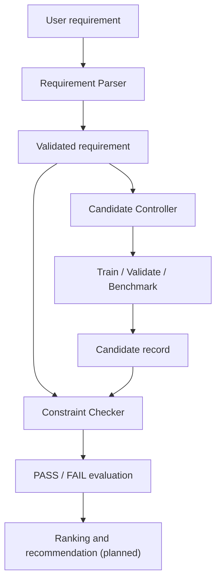

# EdgeNAS-Lite

EdgeNAS-Lite is a lightweight, LLM-guided prototype for selecting and evaluating hardware-aware YOLO configurations under deployment constraints.

The system accepts structured requirements such as minimum accuracy, maximum median latency, maximum model size, target device, and optimization priority. It validates those requirements, compares them with measured candidate results, rejects infeasible candidates, and will later rank the feasible options.

> **Current scope — updated 29 August 2026:** the repository now contains a reproducible YOLO26/KITTI smoke and pilot pipeline, a standardized multi-image CPU benchmark, a machine-readable candidate record, a deterministic Requirement Parser, a Constraint Checker, request–candidate evaluation output, and 22 passing automated tests. Additional candidates, the Knowledge Database, multi-objective ranking, the NAS/Search Controller, the LLM Agent, and the dashboard remain under development.

## Why this project?

Deploying an object detector on edge hardware is not only an accuracy problem. A model must also satisfy practical constraints such as inference latency, model size, available compute, and deployment-device support.

EdgeNAS-Lite explores these trade-offs through a resource-conscious workflow suitable for a personal portfolio project. The first version performs **configuration-level search**, not full architecture-level Neural Architecture Search.

The planned search space may include:

- YOLO model scale;
- input resolution;
- a controlled training budget;
- confidence and IoU thresholds;
- export format;
- numerical precision or quantization.

Direct mutation of the backbone, network graph, or arbitrary layer topology is outside the current scope. If future work adds controlled depth, width, or block choices, the project may be described more precisely as NAS-Lite rather than configuration search.

## Project objectives

- Parse structured YAML or JSON deployment requirements into validated objects.
- Later convert natural-language requirements into the same schema through a bounded LLM interface.
- Train and validate YOLO candidates reproducibly.
- Benchmark candidates on the target device using one documented protocol.
- Store accuracy, latency, parameter count, model size, and benchmark context in machine-readable candidate records.
- Keep reusable candidate measurements separate from request-specific evaluation results.
- Filter candidates that violate hard constraints.
- Rank feasible candidates using multi-objective criteria.
- Store verified model, hardware, deployment, and experiment knowledge.
- Produce both human-readable reports and machine-readable artifacts.

## System design



The future LLM Agent may propose and explain candidates, but it will not generate evaluation metrics. Accuracy, latency, model size, constraint satisfaction, and ranking must be determined by deterministic code using measured data.

## Implemented modules

### Requirement Parser v1

Located in:

```text
src/requirement_parser/
├── __init__.py
├── schema.py
└── parser.py
```

The parser:

- reads YAML, YML, or JSON requirements;
- checks the schema version;
- requires all supported fields;
- rejects unknown fields;
- validates numeric types and ranges;
- restricts the current target to `object_detection`, `cpu`, and `KITTI`;
- validates supported optimization goals;
- returns typed Python dataclasses.

Natural-language parsing is not implemented. A future LLM layer may translate natural language into the same structured schema, while the deterministic parser remains responsible for validation.

### Constraint Checker v1

Located in:

```text
src/constraint_checker/
├── __init__.py
└── checker.py
```

The checker:

- loads a validated requirement;
- loads a candidate JSON record;
- verifies dataset and benchmark-device compatibility;
- compares accuracy, latency, and model-size constraints;
- records the required value, actual value, operator, and pass/fail result;
- produces an overall `constraints_satisfied` result;
- saves the evaluation separately from the candidate.

### Standardized CPU Benchmark v1

Located in:

```text
configs/benchmark_cpu.yaml

src/benchmarking/
├── __init__.py
└── cpu_benchmark.py
```

The benchmark:

- selects a deterministic subset of KITTI validation images;
- preloads images so disk I/O is excluded;
- performs warm-up predictions before measurement;
- measures preprocessing, inference, and postprocessing;
- stores individual latency samples;
- reports mean, median, p95, standard deviation, min, max, and FPS;
- records the software and hardware environment.

## Current progress

| Component | Status |
|---|---|
| Python environment and dependencies | Complete |
| YOLO26 inference smoke test | Complete |
| KITTI dataset and class filtering | Complete |
| One-epoch training smoke test | Complete |
| Ten-epoch KITTI pilot | Complete |
| Full pilot validation | Complete |
| Candidate data contract | Complete |
| Canonical project specification | Complete |
| Demo deployment requirement | Complete |
| Requirement Parser v1 | Complete |
| Constraint Checker v1 | Complete |
| Request–candidate evaluation JSON | Complete |
| Standardized CPU Benchmark v1 | Complete |
| Automated tests | 22/22 passing |
| Additional candidates | Not started |
| Candidate filtering across multiple candidates | Not started |
| Multi-objective ranking | Not started |
| Knowledge Database | Not started |
| NAS/Search Controller | Not started |
| LLM Agent | Not started |
| Dashboard | Not started |

## Experimental setup

| Component | Value |
|---|---|
| Task | 2D object detection |
| Model family | Ultralytics YOLO26 |
| Starting checkpoint | `yolo26n.pt` |
| Dataset | KITTI 2D Object Detection |
| Selected classes | Car, Pedestrian, Cyclist |
| KITTI class IDs | `0`, `3`, `5` |
| Training device | Apple M2 using MPS |
| Deployment target | Local CPU |
| Input size | 640 × 640 |
| Training batch size | 4 |
| Benchmark batch size | 1 |
| Python | 3.9.6 |
| PyTorch | 2.8.0 |
| Ultralytics | 8.4.123 |
| Platform | macOS ARM64 |

The dataset, virtual environment, complete run directories, and pretrained weights are not stored in the repository. Users remain responsible for complying with the relevant dataset and model licenses.

## Results

### 1. KITTI pipeline smoke test

The smoke test trained `yolo26n.pt` for one epoch using 10% of the KITTI training split. Its purpose was to verify dataset loading, label parsing, class filtering, MPS training, validation, and artifact generation.

| Setting | Value |
|---|---:|
| Epochs | 1 |
| Training fraction | 10% |
| Batch size | 4 |
| Validation images | 1,496 |
| Validation instances | 6,989 |

| Class | Precision | Recall | mAP@0.5 | mAP@0.5:0.95 |
|---|---:|---:|---:|---:|
| All | 0.220 | 0.219 | 0.162 | 0.0776 |
| Car | 0.392 | 0.445 | 0.375 | 0.202 |
| Pedestrian | 0.219 | 0.210 | 0.107 | 0.0296 |
| Cyclist | 0.0506 | 0.00284 | 0.00401 | 0.000973 |

The low accuracy is expected because the experiment used one epoch and 10% of the training data. This is a technical pipeline check, not a final model result.

### 2. KITTI pilot experiment

The pilot checkpoint was trained for ten epochs using 25% of the KITTI training split and evaluated on the complete validation split.

| Setting | Value |
|---|---:|
| Candidate ID | `yolo26n_kitti_pilot` |
| Epochs | 10 |
| Training fraction | 25% |
| Batch size | 4 |
| Validation images | 1,496 |
| Validation instances | 6,989 |
| Parameters | 2,376,396 |
| Model size | 5.102 MB |

#### Overall accuracy

| Precision | Recall | mAP@0.5 | mAP@0.5:0.95 |
|---:|---:|---:|---:|
| 0.527 | 0.488 | 0.485 | 0.273 |

#### Per-class accuracy

| Class | Precision | Recall | mAP@0.5 | mAP@0.5:0.95 |
|---|---:|---:|---:|---:|
| Car | 0.670 | 0.756 | 0.779 | 0.516 |
| Pedestrian | 0.468 | 0.475 | 0.432 | 0.198 |
| Cyclist | 0.443 | 0.233 | 0.244 | 0.106 |

#### Improvement over the smoke test

| Metric | Smoke | Pilot | Absolute change |
|---|---:|---:|---:|
| Precision | 0.220 | 0.527 | +0.307 |
| Recall | 0.219 | 0.488 | +0.269 |
| mAP@0.5 | 0.162 | 0.485 | +0.323 |
| mAP@0.5:0.95 | 0.0776 | 0.273 | +0.1954 |

Training and validation losses decreased across the ten epochs while recall and both mAP metrics increased. No clear overfitting was observed during this short pilot.

`Cyclist` remains the most difficult class, especially in recall. This is a useful optimization target for later experiments involving resolution, additional training data, augmentation, or model scale.

### 3. Full validation speed

The same pilot checkpoint was validated on MPS and CPU. Accuracy remained unchanged because both runs used the same weights and split, but execution speed depended on the device and measurement protocol.

| Device | Preprocess | Inference | Postprocess | Notes |
|---|---:|---:|---:|---|
| Apple M2 MPS | 3.0 ms/image | 8.7 ms/image | 1.9 ms/image | Reported after pilot training |
| Local CPU | 0.1 ms/image | 17.0 ms/image | 0.0 ms/image | Batch size 1, full validation split |

The CPU validation processed 1,496 images in approximately 29.6 seconds, or 50.6 iterations per second.

> Ultralytics validation speed and the custom CPU benchmark use different pipelines. Their latency values are not directly comparable.

### 4. Standardized pilot CPU benchmark

The current benchmark uses a deterministic subset of 100 KITTI validation images and excludes disk I/O from the timed section.

#### Protocol

| Setting | Value |
|---|---:|
| Device | Local CPU |
| Image size | 640 |
| Batch size | 1 |
| Selected images | 100 |
| Selection seed | 42 |
| Warm-up runs per session | 10 |
| Repetitions per image | 3 |
| Pooled stable sessions | 3 |
| Total measured samples | 900 |
| Timing scope | Preprocess + inference + postprocess |
| Disk I/O included | No |

Five sessions were retained. The first two were treated as stabilization sessions. The final three consecutive sessions met the practical less-than-5% median-spread criterion and were pooled.

| Session | Median latency | P95 latency | FPS from median | Use |
|---|---:|---:|---:|---|
| 1 | 18.491 ms | 21.735 ms | 54.080 | Stabilization |
| 2 | 18.794 ms | 21.429 ms | 53.210 | Stabilization |
| 3 | 16.052 ms | 16.488 ms | 62.298 | Pooled |
| 4 | 16.545 ms | 16.889 ms | 60.441 | Pooled |
| 5 | 16.485 ms | 17.050 ms | 60.663 | Pooled |

#### Pooled result

| Metric | Value |
|---|---:|
| Samples | 900 |
| Average latency | 16.412 ms |
| Median latency | 16.429 ms |
| P95 latency | 16.848 ms |
| Standard deviation | 0.397 ms |
| FPS from median | 60.868 |

The standard deviation is approximately 2.42% of the average latency, and the three pooled session medians vary by approximately 2.99%.

The FPS value is derived from `1000 / median latency`. It is not the end-to-end FPS of a camera or video application.

Output files:

```text
results/benchmarks/yolo26n_kitti_pilot_cpu.json
results/benchmarks/yolo26n_kitti_pilot_cpu_run1.json
results/benchmarks/yolo26n_kitti_pilot_cpu_run2.json
results/benchmarks/yolo26n_kitti_pilot_cpu_run3.json
results/benchmarks/yolo26n_kitti_pilot_cpu_run4.json
results/benchmarks/yolo26n_kitti_pilot_cpu_run5.json
```

### 5. Historical preliminary microbenchmarks

Earlier single-image measurements are retained as development history:

| Checkpoint | Input | Warm-ups | Runs | Median | FPS |
|---|---|---:|---:|---:|---:|
| Pretrained `yolo26n.pt` | One sample image | 5 | 30 | 31.455 ms | 31.792 |
| KITTI pilot `best.pt` | `bus.jpg` | 5 | 30 | 30.615 ms | 32.663 |

These preliminary measurements do not store representative KITTI samples, p95, standard deviation, or raw samples. They must not be compared directly with the standardized result, and the difference must not be presented as model acceleration.

### 6. First request–candidate evaluation

Demo requirement:

```yaml
schema_version: "1.0"
request_id: edge_cpu_demo

target:
  task: object_detection
  device: cpu
  dataset: KITTI

constraints:
  minimum_map50_95: 0.25
  maximum_median_latency_ms: 35.0
  maximum_model_size_mb: 6.0

preferences:
  optimization_goal: balanced
```

The thresholds are intentionally selected to exercise a passing integration path. They do not prove that the candidate is globally optimal.

| Constraint | Requirement | Candidate | Result |
|---|---:|---:|---|
| Minimum mAP@0.5:0.95 | ≥ 0.25 | 0.273 | PASS |
| Maximum median latency | ≤ 35.0 ms | 16.429 ms | PASS |
| Maximum model size | ≤ 6.0 MB | 5.102 MB | PASS |
| Overall | All hard constraints | All satisfied | PASS |

Output:

```text
results/evaluations/edge_cpu_demo__yolo26n_kitti_pilot.json
```

The candidate remains reusable because its metrics are stored separately from request-specific pass/fail results.

## Data contracts

### Candidate record

```text
results/candidates/yolo26n_kitti_pilot.json
```

The three supported constraints map to measured candidate paths:

| Requirement constraint | Candidate metric path |
|---|---|
| `minimum_map50_95` | `accuracy.map50_95` |
| `maximum_median_latency_ms` | `benchmark.median_latency_ms` |
| `maximum_model_size_mb` | `model.model_size_mb` |

### Project specification

```text
configs/project_spec.yaml
```

This is the canonical definition of the current task, target device, objectives, supported constraints, metric paths, units, and valid ranges. The obsolete duplicate specification at the repository root was removed.

## Automated tests

The current suite contains:

| Module | Tests |
|---|---:|
| Requirement Parser | 8 |
| Constraint Checker | 8 |
| CPU Benchmark | 6 |
| Total | 22 |

Covered cases include:

- valid structured requirements;
- missing and unknown fields;
- invalid accuracy, latency, and model-size ranges;
- unsupported devices and optimization goals;
- candidate PASS and FAIL results;
- dataset and device mismatch;
- missing candidate metrics;
- deterministic image selection;
- excessive benchmark sample size;
- supported image filtering;
- latency-summary calculations;
- CPU-only and batch-size-one benchmark enforcement.

Run:

```bash
python -m unittest discover -s tests -v
```

Expected result:

```text
Ran 22 tests
OK
```

A test named `test_fails_*` reporting `ok` means the checker correctly detected the intended failure.

## Repository structure

```text
EdgeNAS-Lite/
├── artifacts/
│   └── kitti_pilot/
│       ├── confusion_matrix.png
│       ├── metrics.json
│       ├── results.csv
│       ├── results.png
│       └── val_batch0_pred.jpg
├── configs/
│   ├── requests/
│   │   └── edge_cpu_demo.yaml
│   ├── benchmark_cpu.yaml
│   ├── project_spec.yaml
│   ├── kitti_smoke.yaml
│   ├── kitti_pilot.yaml
│   └── kitti_val_cpu.yaml
├── results/
│   ├── benchmarks/
│   │   ├── yolo26n_kitti_pilot_cpu.json
│   │   └── yolo26n_kitti_pilot_cpu_run*.json
│   ├── candidates/
│   │   └── yolo26n_kitti_pilot.json
│   ├── evaluations/
│   │   └── edge_cpu_demo__yolo26n_kitti_pilot.json
│   ├── baseline_benchmark.json
│   └── pilot_cpu_benchmark.json
├── src/
│   ├── benchmarking/
│   │   ├── __init__.py
│   │   └── cpu_benchmark.py
│   ├── constraint_checker/
│   │   ├── __init__.py
│   │   └── checker.py
│   ├── requirement_parser/
│   │   ├── __init__.py
│   │   ├── schema.py
│   │   └── parser.py
│   ├── knowledge_database/
│   ├── llm_agent/
│   └── nas_controller/
├── tests/
│   ├── test_cpu_benchmark.py
│   ├── test_constraint_checker.py
│   └── test_requirement_parser.py
├── .gitignore
├── README.md
├── requirements.txt
└── smoke_test.py
```

Generated datasets, virtual environments, large model weights, complete run directories, and local ZIP archives must remain outside version control.

## Installation

### 1. Clone the repository

```bash
git clone https://github.com/doquangminh03/EdgeNAS-Lite.git
cd EdgeNAS-Lite
```

### 2. Create a virtual environment

macOS or Linux:

```bash
python3 -m venv .venv
source .venv/bin/activate
```

Windows PowerShell:

```powershell
python -m venv .venv
.venv\Scripts\Activate.ps1
```

### 3. Install dependencies

```bash
python -m pip install --upgrade pip
pip install -r requirements.txt
```

### 4. Verify the installation

```bash
python -c "import torch, ultralytics, yaml; print('Torch:', torch.__version__); print('Ultralytics:', ultralytics.__version__)"
```

## Running the project

Run all commands from the repository root.

### Inference smoke test

```bash
python smoke_test.py
```

### KITTI training smoke test

```bash
yolo detect train cfg=configs/kitti_smoke.yaml device=mps
```

### KITTI pilot training

```bash
yolo detect train cfg=configs/kitti_pilot.yaml device=mps
```

Expected local checkpoint:

```text
runs/detect/kitti_yolo26n_pilot/weights/best.pt
```

### Validate the pilot checkpoint on CPU

```bash
yolo detect val cfg=configs/kitti_val_cpu.yaml
```

### Run the standardized CPU benchmark

```bash
python -m src.benchmarking.cpu_benchmark \
  configs/benchmark_cpu.yaml
```

The benchmark config currently selects 100 KITTI validation images, performs 10 warm-ups, and records 300 samples per session.

### Parse the demo requirement

```bash
python -m src.requirement_parser.parser \
  configs/requests/edge_cpu_demo.yaml
```

### Evaluate the pilot candidate

```bash
python -m src.constraint_checker.checker \
  configs/requests/edge_cpu_demo.yaml \
  results/candidates/yolo26n_kitti_pilot.json \
  --output results/evaluations/edge_cpu_demo__yolo26n_kitti_pilot.json
```

### Run all tests

```bash
python -m unittest discover -s tests -v
```

## Experiment configurations

| File | Purpose |
|---|---|
| `configs/project_spec.yaml` | Canonical scope, target, objectives, constraints, and metric paths |
| `configs/requests/edge_cpu_demo.yaml` | Structured deployment requirement |
| `configs/benchmark_cpu.yaml` | Standard CPU benchmark protocol |
| `configs/kitti_smoke.yaml` | One-epoch, 10% pipeline test |
| `configs/kitti_pilot.yaml` | Ten-epoch, 25% pilot experiment |
| `configs/kitti_val_cpu.yaml` | Full CPU validation of the pilot checkpoint |
| `runs/**/args.yaml` | Full Ultralytics-generated experiment configuration |

Human-authored configs remain concise. Generated `args.yaml` files may contain absolute local paths and should be reviewed before publication.

## Metrics

- **Precision:** proportion of predicted detections that are correct.
- **Recall:** proportion of ground-truth objects detected.
- **mAP@0.5:** mean Average Precision at IoU 0.5.
- **mAP@0.5:0.95:** mean Average Precision averaged across IoU thresholds from 0.5 to 0.95.
- **Median latency:** middle measured time after sorting latency samples.
- **P95 latency:** latency threshold not exceeded by 95% of samples.
- **Standard deviation:** variability of measured latency.
- **Throughput:** inputs processed per second, here derived from median latency.
- **Model size:** checkpoint size on disk, not runtime memory usage.

Every latency result must state the device, image size, batch size, warm-up count, measured-sample count, timing scope, and whether disk I/O is included.

## Candidate search space

The first automated version will use a small, controlled space:

- YOLO model scale;
- input resolution;
- controlled training budget;
- confidence and IoU thresholds;
- export format;
- quantization mode.

All candidates must use the same validation split and standardized benchmark protocol. Changing only input size or inference thresholds is configuration search, not architecture mutation.

## Limitations

- The pilot uses 25% of the KITTI training split and ten epochs.
- Only one measured candidate currently exists; ranking one candidate is meaningless.
- `Cyclist` performance remains substantially lower than `Car` performance.
- The standardized latency result applies to one local macOS ARM64 CPU environment.
- Latency can still vary with background load, power state, thermal state, and software versions.
- The first two benchmark sessions were retained as stabilization evidence but excluded from the pooled result.
- Ultralytics validation speed, preliminary microbenchmarks, and the standardized benchmark use different timing scopes.
- The standardized benchmark does not measure camera capture, disk I/O, display, or a complete application pipeline.
- The demo request is intentionally configured to pass and is not evidence of global optimality.
- Natural-language parsing, the Knowledge Database, additional candidate generation, ranking, the automated controller, and the dashboard are not implemented.
- The current project performs configuration search, not full neural architecture mutation.

## Portfolio evidence

The public repository emphasizes reproducible evidence rather than terminal screenshots:

- human-authored YAML configurations;
- deterministic parser and checker source code;
- benchmark protocol and raw samples;
- candidate and evaluation JSON files;
- automated tests;
- learning curves and validation metrics;
- confusion matrix and selected predictions;
- explicit limitations and future work.

The repository should not include `.venv/`, downloaded datasets, API keys, complete generated runs, large model weights, absolute user paths, or local ZIP archives.

## Roadmap

1. Commit and publish the standardized benchmark milestone.
2. Define a small, controlled candidate search space.
3. Evaluate additional resolution or model-scale candidates using the same KITTI split and CPU benchmark.
4. Add deterministic filtering across multiple candidate records.
5. Implement multi-objective scoring or Pareto ranking.
6. Build the verified experiment and hardware Knowledge Database.
7. Implement the NAS/Search Controller with caching, budget limits, and stopping rules.
8. Add bounded LLM requirement translation and candidate explanation.
9. Build a compact evaluation dashboard.

## Reproducibility notes

- Run commands from the repository root.
- Keep the random seed and selected validation images fixed when comparing candidates.
- Use the same dataset split, class filter, image size, and benchmark timing scope.
- Benchmark candidates under comparable power, thermal, and background-load conditions.
- Record model path, device, batch size, software versions, warm-up count, session count, and raw samples.
- Do not compare latency values produced by different devices or protocols as if they were equivalent.
- Preserve human-authored configs, selected artifacts, and machine-readable result files.
- Keep reusable candidate measurements separate from request-specific evaluations.
- Do not let the LLM create or overwrite measured metrics.

## References

- [Ultralytics YOLO26](https://docs.ultralytics.com/models/yolo26/)
- [Ultralytics KITTI Dataset](https://docs.ultralytics.com/datasets/detect/kitti/)
- [Ultralytics KITTI configuration](https://github.com/ultralytics/ultralytics/blob/main/ultralytics/cfg/datasets/kitti.yaml)
- [Ultralytics Train Mode](https://docs.ultralytics.com/modes/train/)
- [Ultralytics Validation Mode](https://docs.ultralytics.com/modes/val/)
- [Ultralytics Predict Mode](https://docs.ultralytics.com/modes/predict/)
- [Ultralytics Performance Metrics](https://docs.ultralytics.com/guides/yolo-performance-metrics/)
- [KITTI Vision Benchmark Suite](https://www.cvlibs.net/datasets/kitti/)
- [Python `time.perf_counter`](https://docs.python.org/3/library/time.html#time.perf_counter)

## Acknowledgements

Core orchestration, validation, and evaluation code for EdgeNAS-Lite is developed as original portfolio work. Ultralytics YOLO, pretrained weights, KITTI data, official APIs, documentation, and externally adapted implementations remain credited to their respective authors and licenses.
