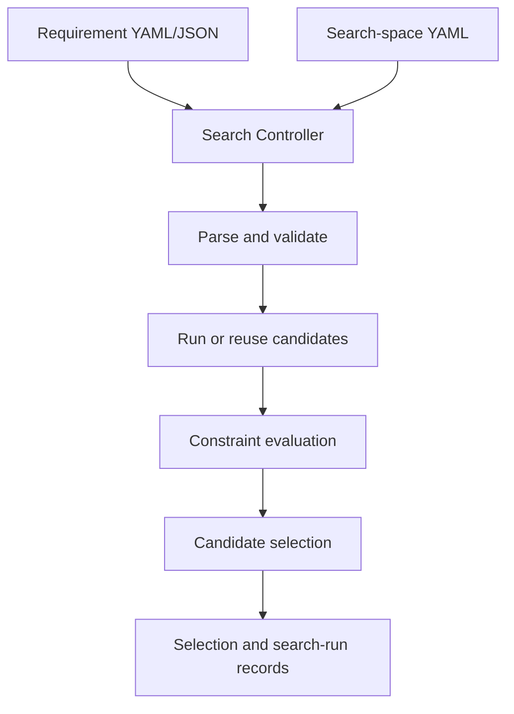
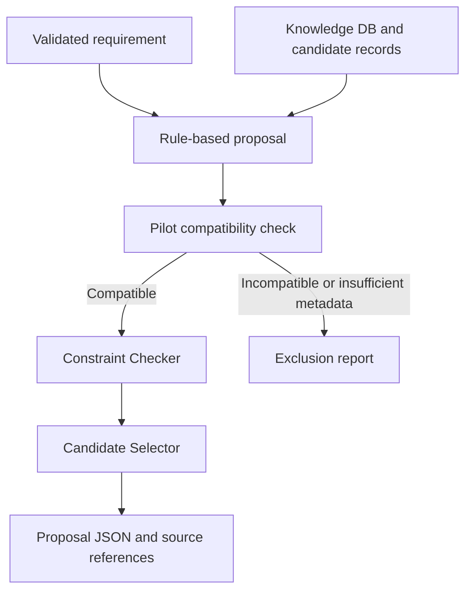
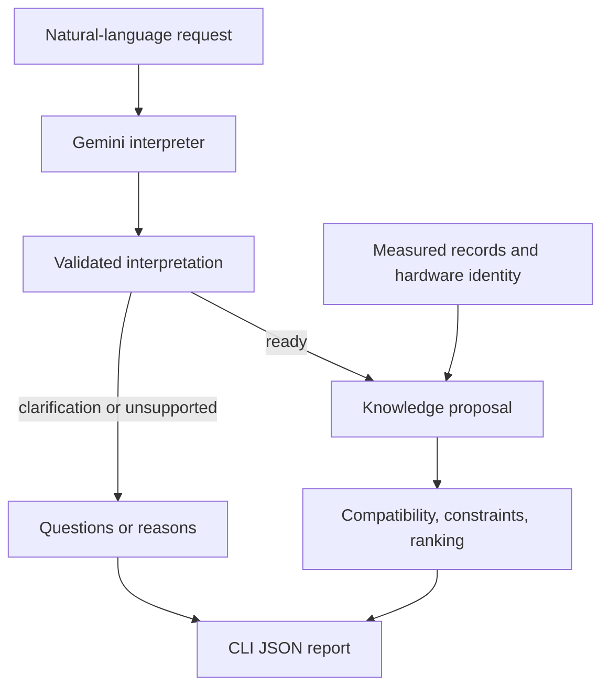

# EdgeNAS-Lite

EdgeNAS-Lite is a lightweight, deterministic prototype for selecting and evaluating hardware-aware YOLO configurations under deployment constraints, with a working Gemini natural-language requirement interface and a deterministic proposal pipeline.

The system accepts natural-language requests through Gemini or structured requirements specifying minimum accuracy, maximum median latency, maximum model size, target device, and optimization priority. It validates those requirements, compares them with measured candidate results, rejects infeasible candidates, ranks feasible options, and produces a deterministic final selection.

> **Current scope — updated 17 September 2026:** the repository contains the YOLO26/KITTI pilot, standardized CPU benchmarking, deterministic requirement/search-space parsing, Candidate Runner, Constraint Checker, Candidate Selector, Search Controller, Knowledge DB, and compatibility-gated Rule-based Proposal with its CLI. The latest milestone adds a bounded LLM requirement interpreter, a real Gemini provider, and `python -m src.llm_agent.cli`. A Vietnamese request was interpreted, validated, and used to select the measured 416 configuration; the saved CLI requirement was checked against the original request. The user confirmed **158 full-suite tests passed**, then **8 new LLM CLI tests passed separately**. The expected combined count is **166**, pending a full-suite rerun. LLM-generated new configurations, budgeted LLM experiment orchestration, broader search dimensions, and a dashboard remain future work.

## Why this project?

Deploying an object detector on edge hardware is not only an accuracy problem. A model must also satisfy practical constraints such as inference latency, model size, available compute, and deployment-device support.

EdgeNAS-Lite explores these trade-offs through a resource-conscious workflow suitable for a personal portfolio project. The first version performs **configuration-level search**, not full architecture-level Neural Architecture Search.

The planned search space may include:

- YOLO model scale;
- input resolution;
- a controlled training budget;
- confidence and IoU thresholds;
- export format;
- numerical precision or quantization.

Direct mutation of the backbone, network graph, or arbitrary layer topology is outside the current scope. If future work adds controlled depth, width, or block choices, the project may be described more precisely as NAS-Lite rather than configuration search.

## Project objectives

- Parse structured YAML or JSON deployment requirements into validated objects.
- Convert natural-language requirements into the same schema through a bounded LLM interface and deterministic validation.
- Train and validate YOLO candidates reproducibly.
- Benchmark candidates on the target device using one documented protocol.
- Store accuracy, latency, parameter count, model size, and benchmark context in machine-readable candidate records.
- Keep reusable candidate measurements separate from request-specific evaluation results.
- Filter candidates that violate hard constraints.
- Rank feasible candidates using multi-objective criteria.
- Store verified model, hardware, deployment, and experiment knowledge.
- Produce both human-readable reports and machine-readable artifacts.

## System design



The Search Controller orchestrates the deterministic modules and reuses compatible candidate records when available. The implemented LLM interface translates natural-language requirements for the separate knowledge-proposal workflow. LLM-generated search spaces and experiment orchestration remain future work. The LLM does not generate measured metrics. Accuracy, latency, model size, constraint satisfaction, and ranking remain the responsibility of deterministic code.

### Rule-based proposal workflow



This additional workflow selects from existing measured records. It reuses the deterministic modules but does not invoke the Search Controller to run new experiments. The Knowledge DB index contains references only; the proposal JSON includes snapshots of the retrieved records so the decision can be inspected later.

## Implemented modules

### Requirement Parser v1

Located in:

```text
src/requirement_parser/
├── __init__.py
├── schema.py
└── parser.py
```

The parser:

- reads YAML, YML, or JSON requirements;
- checks the schema version;
- requires all supported fields;
- rejects unknown fields;
- validates numeric types and ranges;
- restricts the current target to `object_detection`, `cpu`, and `KITTI`;
- validates supported optimization goals;
- returns typed Python dataclasses.

Natural-language interpretation is implemented in `src/llm_agent/interpreter.py`. Gemini translates the request into the supported schema; deterministic validation remains responsible for accepting or rejecting the structured result. Schema validity alone does not prove that the interpretation matches the user’s intent.

### Constraint Checker v1

Located in:

```text
src/constraint_checker/
├── __init__.py
└── checker.py
```

The checker:

- loads a validated requirement;
- loads a candidate JSON record;
- verifies dataset and benchmark-device compatibility;
- compares accuracy, latency, and model-size constraints;
- records the required value, actual value, operator, and pass/fail result;
- produces an overall `constraints_satisfied` result;
- saves the evaluation separately from the candidate.

### Standardized CPU Benchmark v1

Located in:

```text
configs/benchmark_cpu.yaml

src/benchmarking/
├── __init__.py
└── cpu_benchmark.py
```

The benchmark:

- selects a deterministic subset of KITTI validation images;
- preloads images so disk I/O is excluded;
- performs warm-up predictions before measurement;
- measures preprocessing, inference, and postprocessing;
- stores individual latency samples;
- reports mean, median, p95, standard deviation, min, max, and FPS;
- records the software and hardware environment.

### Search Space Parser v1

Located in:

```text
configs/search_space.yaml

src/search_space/
├── __init__.py
└── parser.py
```

The parser:

- validates the search-space schema and supported search strategy;
- separates fixed configuration from variable dimensions;
- checks the checkpoint, benchmark configuration, and reusable candidate paths;
- validates KITTI dataset metadata, class names, and class IDs;
- requires positive, unique image sizes divisible by 32;
- enforces the experiment budget and required metric contract;
- expands the grid into deterministic candidate IDs;
- marks the existing 640 candidate for reuse instead of reevaluation.

The current search varies only deployment input resolution. It does not retrain the checkpoint or mutate the YOLO architecture.

### Candidate Runner v1

Located in:

```text
src/candidate_runner/
├── __init__.py
└── runner.py
```

The runner:

- consumes the validated search space;
- supports a non-mutating `--dry-run` execution plan;
- runs full KITTI validation for pending candidates;
- preserves the validation confidence behavior used for AP calculation;
- executes five isolated CPU benchmark sessions per new candidate;
- excludes the first two stabilization sessions;
- pools raw latency samples from sessions three through five;
- writes reusable candidate JSON records without embedding request constraints;
- reuses the existing 640 record;
- refuses to overwrite generated records unless `--overwrite` is explicitly supplied.

### Candidate Selector v1

Located in:

```text
src/candidate_selector/
├── __init__.py
└── selector.py
```

The selector:

- loads evaluation JSON records belonging to the same `request_id`;
- checks evaluation thresholds and pass/fail consistency against the current requirement; it does not independently remeasure metrics or detect every possible alteration;
- separates candidates into feasible and rejected groups;
- handles zero, one, or multiple feasible candidates deterministically;
- supports `accuracy`, `latency`, `model_size`, and `balanced` optimization goals;
- ranks multiple feasible candidates using request-specific metrics;
- writes a machine-readable selection record with the ranking and final choice.

The current balanced strategy uses equal-weight headroom across accuracy, latency, and model size. This scoring rule is an explicit prototype policy rather than a claim of universal optimality.

#### Balanced scoring policy

Only candidates satisfying every hard constraint are ranked.

The current policy measures normalized headroom relative to the
deployment requirements:

- Accuracy: `(map50_95 - minimum_map50_95) / (1 - minimum_map50_95)`
- Latency: `(maximum_median_latency_ms - median_latency_ms) / maximum_median_latency_ms`
- Model size: `(maximum_model_size_mb - model_size_mb) / maximum_model_size_mb`

Each component is clamped to [0, 1] and rounded to six decimal places.
The balanced score is the arithmetic mean of the three components,
then rounded to six decimal places. Higher scores rank first.

When minimum accuracy equals 1.0, the implementation assigns accuracy
headroom 1.0 to avoid division by zero. Only candidates with accuracy
1.0 can be feasible in that case.

For equal balanced scores, ties are resolved in this order:

1. Higher mAP50–95.
2. Lower median latency.
3. Smaller model size.
4. Candidate ID in ascending lexicographic order.

This is a fixed equal-weight policy. Its normalization and requirement
thresholds influence the ranking; the score is not an accuracy metric
or a guarantee of globally optimal deployment performance.

### Search Controller v1

Located in:

```text
src/search_controller/
├── __init__.py
└── controller.py
```

The controller:

- connects the Requirement Parser, Search Space Parser, Candidate Runner, Constraint Checker, and Candidate Selector;
- verifies that task, device, and dataset targets match across the requirement and search space;
- checks candidate identity, checkpoint, image size, and standardized benchmark status before reuse;
- reuses compatible candidate records by default;
- calls the Candidate Runner only when a required candidate record is missing;
- supports a non-mutating `--dry-run` plan;
- supports explicit candidate remeasurement through `--overwrite-candidates`;
- writes evaluation files, a final selection record, and a search-run manifest.

### Knowledge Database v1

The Knowledge DB is a searchable experiment record collection. It references existing measured candidate JSON files rather than maintaining duplicate metric values or running new experiments.

Files:

- `knowledge/index.yaml`: schema version, knowledge-base ID, and candidate references.
- `src/knowledge_database/loader.py`: `load_knowledge_base`, `validate_candidate_metrics`, and `KnowledgeValidationError`.
- `src/knowledge_database/query.py`: `query_candidates`.
- `src/knowledge_database/__init__.py`: package marker.

The loader validates the index fields and version, non-empty identifiers, duplicate candidate IDs, relative record paths, and agreement between index and JSON candidate IDs. Resolved record paths must remain inside the project root. Missing files raise `FileNotFoundError`; malformed JSON raises a JSON parsing error.

Metric validation currently covers:

| Candidate field | Valid values |
|---|---|
| `accuracy.map50_95` | Numeric, finite, between 0 and 1 inclusive |
| `benchmark.median_latency_ms` | Numeric, finite, greater than 0 |
| `model.model_size_mb` | Numeric, finite, greater than 0 |

Booleans, numeric strings, missing values, NaN, and infinity are rejected for these metrics. This checks data validity; deployment feasibility is still evaluated by the Constraint Checker.

The loader returns `schema_version`, `knowledge_base_id`, and a `candidates` list. Each entry preserves both `record_path` and the loaded `record` for provenance.

Query filters map to the following fields:

| Argument | Record field | Meaning |
|---|---|---|
| `dataset` | `accuracy.dataset` | Dataset used for accuracy evaluation |
| `model_family` | `model.family` | Model family, such as YOLO26 |
| `device` | `benchmark.device` | Device used for latency measurement |

Supplied filters use AND logic, ignore letter case and surrounding whitespace, and reject empty or non-string filter values. Omitted filters impose no restriction. Results are sorted by candidate ID and deep-copied so changes to query results do not mutate the loaded knowledge base. No matches return an empty list.

The current index references the measured 416, 512, and 640 configurations. The Knowledge DB is available as a Python API and is consumed by Rule-based Proposal v1. The Search Controller does not yet consume the Knowledge DB directly. It does not rank candidates, generate metrics, or establish that measurements from different hardware or protocols are comparable.

### Candidate Compatibility v1

Implemented in `src/proposal/compatibility.py` through
`check_candidate_compatibility(record, expected_hardware_id=...)`.
The current policy ID is `kitti_cpu_pilot_v1`.

| Metadata | Required by the pilot policy |
|---|---|
| Accuracy and benchmark dataset / split | `KITTI` / `val` |
| Validation images / instances | 1,496 / 6,989 |
| Evaluated class names in `accuracy.per_class` | Exactly `car`, `pedestrian`, `cyclist` |
| Benchmark device / batch size | `cpu` / 1 |
| Protocol version / status | `cpu_v1` / `standardized` |
| Timing scope | `preprocess_inference_postprocess` |
| Disk I/O included | `false` |
| Selected images / selection seed | 100 / 42 |
| Pooled sessions / warm-ups per session / repetitions per image | 3 / 10 / 3 |
| Accuracy and benchmark image size | Positive integers divisible by 32, equal within each candidate |
| Hardware identity | Non-empty record identifier matching the supplied target identifier |

Input resolution may differ across candidates. The current experiment compares
416, 512, and 640; the compatibility function does not restrict sizes to this
three-value list. It checks evaluated class names, not per-class metric values
or class-ID mappings.

Reports include `candidate_id`, `policy_id`, `status`, `missing_fields`,
`mismatches`, and `unverified`. Status is:

- `compatible`: all checks in this policy pass.
- `incompatible`: at least one checked field conflicts with the policy; this
  takes precedence even when other metadata is missing.
- `insufficient_metadata`: no conflict was detected, but required evidence is
  missing or the target hardware identifier was not supplied.

The three current records use `benchmark.hardware_id: local_mac_cpu_01`.
This is a project-local identifier assigned after the operator confirmed that
all three benchmarks ran on the same physical Mac. It is not an automatically
measured serial number. The pilot record also now stores
`accuracy.image_size: 640`, based on operator confirmation and review of
`configs/kitti_val_cpu.yaml`. `metadata_provenance` preserves these sources;
measured accuracy and latency values were not changed.

This policy is enforced by the proposal workflow. The Knowledge DB loader,
Search Controller reuse checks, and standalone Candidate Selector do not
independently enforce this complete policy. A compatible report establishes
agreement with the listed metadata, not complete experimental equivalence:
software versions, CPU thread count, exact image identities, and runtime
power/thermal conditions are not checked by this function.

### Rule-based Proposal v1

Implemented files:

- `src/proposal/rule_based.py`: retrieve, check compatibility, evaluate, and select.
- `src/proposal/compatibility.py`: pilot evidence compatibility policy.
- `src/proposal/output.py`: save proposal results as JSON.

The workflow:

1. Loads and validates a structured requirement.
2. Retrieves candidate records by dataset, benchmark device, and optional model family.
3. Checks each record against the pilot policy and target hardware identifier.
4. Excludes incompatible or insufficiently documented records, preserving reports.
5. Evaluates compatible candidates against accuracy, latency, and model-size constraints.
6. Ranks feasible candidates and returns the selection with its source record path.

| Proposal status | Meaning |
|---|---|
| `selected` | A compatible candidate satisfies the constraints and is selected |
| `no_matching_candidates` | No record matches the retrieval filters |
| `no_compatible_candidates` | Records were retrieved, but none passed compatibility |
| `no_feasible_candidate` | Compatible records were evaluated, but none met all constraints |

For both no-matching and no-compatible results, `selection` and
`selected_source` are `None` (JSON `null`). A no-feasible result retains a
selection report with an empty ranking and no selected candidate.

Supply `expected_hardware_id="local_mac_cpu_01"` for the current demo.
Omitting it leaves target hardware unverified and prevents selection when
records are retrieved. An unknown machine identifier must not be relabeled
as this local Mac merely to make a record pass.

The saved low-latency demo contains three compatible candidates, no
compatibility exclusions, two feasible candidates, and the following ranking:

- 416: selected with balanced score 0.143132.
- 512: ranked second with balanced score 0.087805.
- 640: rejected by the latency constraint (16.429 ms > 12 ms).

Saved example: `results/proposals/low_latency_balanced_demo.json`.

The JSON includes the requirement, retrieved candidate snapshots,
`expected_hardware_id`, `compatibility_reports`, `compatible_candidate_ids`,
`excluded_candidate_ids`, constraint evaluations, ranking, and selected source.
Compatibility reports include each record's source path.
`rejected_candidate_ids` identifies compatible candidates that failed deployment
constraints; it is distinct from `excluded_candidate_ids`.
Saving to an existing output path replaces it.

Eight proposal tests cover the original four selection outcomes plus different
hardware, unspecified target hardware, missing record metadata, and conflicting
benchmark timing scope. Nine separate tests cover the compatibility function.
This workflow selects existing measured configurations; it does not generate
new configurations, run experiments, or use an LLM.

### Proposal CLI v1

`src/proposal/cli.py` wraps the existing proposal API, requires explicit hardware
identity, writes a JSON result, and prints a concise selection summary. Exit
codes distinguish selected (`0`), evaluated without selection (`1`), and handled
input/file errors (`2`). Eight subprocess tests exercise the command-line entry
point. See the CLI usage section for commands and path semantics.

### LLM requirement interface v1 and Gemini provider

The implemented LLM layer interprets requirements; candidate retrieval, compatibility, constraint checking, and ranking remain deterministic.

Known entry points:

- `src/llm_agent/interpreter.py`: `interpret_requirement`.
- `src/llm_agent/gemini_provider.py`: `GeminiProvider` and `GeminiProviderError`.
- `src/llm_agent/cli.py`: natural-language-to-proposal CLI.

The interpreter returns one of three statuses:

| Status | Downstream behavior |
|---|---|
| `ready` | Validate the structured requirement and pass it to the proposal workflow |
| `needs_clarification` | Return questions; do not select a candidate |
| `unsupported` | Return reasons; do not select a candidate |

The Gemini provider reads `GEMINI_API_KEY`, sends the request through HTTP, requests JSON output, and extracts response text while ignoring thought parts. Twelve offline tests cover request construction, input validation, API-key redaction in HTTP errors, network/time-out failures, malformed responses, abnormal finish reasons, and missing text. Mocked HTTP tests verify the adapter contract, not live model quality.

### LLM CLI v1



The CLI calls Gemini once, then invokes `propose_from_knowledge` only for a `ready` interpretation. It passes the requirement through a temporary file that is removed after use. It does not invoke the Search Controller or run new training, validation, or benchmarks.

Its report preserves `schema_version`, `request_id`, `user_text`, provider name/model, `expected_hardware_id`, `model_family`, `interpretation`, and `proposal`. For clarification or unsupported requests, `proposal` is JSON `null`.

| Exit code | Meaning |
|---|---|
| `0` | A candidate was selected and the report was saved |
| `1` | Report saved, but clarification, unsupported scope, or no selection |
| `2` | Argument error or handled provider, validation, or file error |

The LLM CLI requires a new `.json` output path and uses exclusive file creation: existing files are not overwritten. This differs from the existing structured Proposal CLI and `save_proposal()`, which may replace a proposal output.

Eight offline CLI tests cover successful handoff and persistence, clarification, unsupported requests, no feasible candidate, provider errors, invalid JSON, existing-output protection, and missing hardware arguments. They retain the real interpreter/validation, replace the provider and proposal call, and block real HTTP.

## Current progress

| Component | Status |
|---|---|
| Python environment and dependencies | Complete |
| YOLO26 inference smoke test | Complete |
| KITTI dataset and class filtering | Complete |
| One-epoch training smoke test | Complete |
| Ten-epoch KITTI pilot | Complete |
| Full pilot validation | Complete |
| Candidate data contract | Complete |
| Canonical project specification | Complete |
| Demo deployment requirement | Complete |
| Requirement Parser v1 | Complete |
| Constraint Checker v1 | Complete |
| Request–candidate evaluation JSON | Complete |
| Standardized CPU Benchmark v1 | Complete |
| Resolution search-space definition | Complete |
| Search Space Parser v1 | Complete |
| Candidate Runner v1 | Complete |
| 416 and 512 candidate evaluation | Complete |
| Evaluation JSON files for two demo requirements | Complete |
| Candidate Selector v1 | Complete |
| Multi-objective ranking v1 | Complete |
| Search Controller v1 | Complete |
| End-to-end pipeline execution | Complete for two demo requirements |
| Selection and search-run JSON records | Complete |
| Automated tests | 158 full-suite tests passed; 8 new LLM CLI tests passed separately; expected combined count 166, rerun pending |
| Candidate filtering across multiple candidates | Complete |
| Knowledge Database v1: index, loader, metric validation, queries | Complete; 19 tests passed |
| Knowledge DB integration with proposal workflow | Complete for retrieval, evaluation, and selection |
| Rule-based proposal baseline | Complete with compatibility gate; 8 automated tests |
| Proposal CLI v1 | Complete; 8 subprocess tests |
| Proposal JSON output | Complete; saved demo verified by reading the JSON back |
| Pilot proposal compatibility policy and gate | Complete; 9 compatibility tests |
| Generalized compatibility across datasets and hardware | Planned |
| LLM requirement interpreter | Implemented; structured validation and three interpretation statuses |
| Gemini provider | Implemented; live demo succeeded and 12 offline provider tests passed |
| Natural-language proposal CLI | Implemented; saved demo checked and 8 offline CLI tests passed |
| LLM-generated new configurations and experiment loop | Planned |
| Dashboard | Not started |

Earlier documented commits: Knowledge DB v1 (`e733835`), original Rule-based Proposal (`d5010b5`), and pilot compatibility/metadata (`9d75c54`). The latest local milestone is the Gemini interpreter/provider and natural-language CLI. Commit and push of this latest milestone have not been confirmed. Test and live-demo statuses above are based on the user's reported local results; this documentation edit did not execute the repository tests.

## Experimental setup

| Component | Value |
|---|---|
| Task | 2D object detection |
| Model family | Ultralytics YOLO26 |
| Starting checkpoint | `yolo26n.pt` |
| Dataset | KITTI 2D Object Detection |
| Selected classes | Car, Pedestrian, Cyclist |
| KITTI class IDs | `0`, `3`, `5` |
| Training device | Apple M2 using MPS |
| Deployment target | Local CPU (`local_mac_cpu_01`, operator-confirmed identity) |
| Search input sizes | 416 × 416, 512 × 512, 640 × 640 |
| Training batch size | 4 |
| Benchmark batch size | 1 |
| Python | 3.9.6 |
| PyTorch | 2.8.0 |
| Ultralytics | 8.4.123 |
| Platform | macOS ARM64 |

The dataset, virtual environment, complete run directories, and pretrained weights are not stored in the repository. Users remain responsible for complying with the relevant dataset and model licenses.

## Results

### 1. KITTI pipeline smoke test

The smoke test trained `yolo26n.pt` for one epoch using 10% of the KITTI training split. Its purpose was to verify dataset loading, label parsing, class filtering, MPS training, validation, and artifact generation.

| Setting | Value |
|---|---:|
| Epochs | 1 |
| Training fraction | 10% |
| Batch size | 4 |
| Validation images | 1,496 |
| Validation instances | 6,989 |

| Class | Precision | Recall | mAP@0.5 | mAP@0.5:0.95 |
|---|---:|---:|---:|---:|
| All | 0.220 | 0.219 | 0.162 | 0.0776 |
| Car | 0.392 | 0.445 | 0.375 | 0.202 |
| Pedestrian | 0.219 | 0.210 | 0.107 | 0.0296 |
| Cyclist | 0.0506 | 0.00284 | 0.00401 | 0.000973 |

The low accuracy is expected because the experiment used one epoch and 10% of the training data. This is a technical pipeline check, not a final model result.

### 2. KITTI pilot experiment

The pilot checkpoint was trained for ten epochs using 25% of the KITTI training split and evaluated on the complete validation split.

| Setting | Value |
|---|---:|
| Candidate ID | `yolo26n_kitti_pilot` |
| Epochs | 10 |
| Training fraction | 25% |
| Batch size | 4 |
| Validation images | 1,496 |
| Validation instances | 6,989 |
| Parameters | 2,376,396 |
| Model size | 5.102 MB |

#### Overall accuracy

| Precision | Recall | mAP@0.5 | mAP@0.5:0.95 |
|---:|---:|---:|---:|
| 0.527 | 0.488 | 0.485 | 0.273 |

#### Per-class accuracy

| Class | Precision | Recall | mAP@0.5 | mAP@0.5:0.95 |
|---|---:|---:|---:|---:|
| Car | 0.670 | 0.756 | 0.779 | 0.516 |
| Pedestrian | 0.468 | 0.475 | 0.432 | 0.198 |
| Cyclist | 0.443 | 0.233 | 0.244 | 0.106 |

#### Improvement over the smoke test

| Metric | Smoke | Pilot | Absolute change |
|---|---:|---:|---:|
| Precision | 0.220 | 0.527 | +0.307 |
| Recall | 0.219 | 0.488 | +0.269 |
| mAP@0.5 | 0.162 | 0.485 | +0.323 |
| mAP@0.5:0.95 | 0.0776 | 0.273 | +0.1954 |

Training and validation losses decreased across the ten epochs while recall and both mAP metrics increased. No clear overfitting was observed during this short pilot.

`Cyclist` remains the most difficult class, especially in recall. This is a useful optimization target for later experiments involving resolution, additional training data, augmentation, or model scale.

### 3. Full validation speed

The same pilot checkpoint was validated on MPS and CPU. Accuracy remained unchanged because both runs used the same weights and split, but execution speed depended on the device and measurement protocol.

| Device | Preprocess | Inference | Postprocess | Notes |
|---|---:|---:|---:|---|
| Apple M2 MPS | 3.0 ms/image | 8.7 ms/image | 1.9 ms/image | Reported after pilot training |
| Local CPU | 0.1 ms/image | 17.0 ms/image | 0.0 ms/image | Batch size 1, full validation split |

The CPU validation processed 1,496 images in approximately 29.6 seconds, or 50.6 iterations per second.

> Ultralytics validation speed and the custom CPU benchmark use different pipelines. Their latency values are not directly comparable.

### 4. Standardized pilot CPU benchmark

The current benchmark uses a deterministic subset of 100 KITTI validation images and excludes disk I/O from the timed section.

#### Protocol

| Setting | Value |
|---|---:|
| Device | Local CPU |
| Image size | 640 |
| Batch size | 1 |
| Selected images | 100 |
| Selection seed | 42 |
| Warm-up runs per session | 10 |
| Repetitions per image | 3 |
| Pooled stable sessions | 3 |
| Total measured samples | 900 |
| Timing scope | Preprocess + inference + postprocess |
| Disk I/O included | No |

Five sessions were retained. The first two were treated as stabilization sessions. The final three consecutive sessions met the practical less-than-5% median-spread criterion and were pooled.

| Session | Median latency | P95 latency | FPS from median | Use |
|---|---:|---:|---:|---|
| 1 | 18.491 ms | 21.735 ms | 54.080 | Stabilization |
| 2 | 18.794 ms | 21.429 ms | 53.210 | Stabilization |
| 3 | 16.052 ms | 16.488 ms | 62.298 | Pooled |
| 4 | 16.545 ms | 16.889 ms | 60.441 | Pooled |
| 5 | 16.485 ms | 17.050 ms | 60.663 | Pooled |

#### Pooled result

| Metric | Value |
|---|---:|
| Samples | 900 |
| Average latency | 16.412 ms |
| Median latency | 16.429 ms |
| P95 latency | 16.848 ms |
| Standard deviation | 0.397 ms |
| FPS from median | 60.868 |

The standard deviation is approximately 2.42% of the average latency, and the three pooled session medians vary by approximately 2.99%.

The FPS value is derived from `1000 / median latency`. It is not the end-to-end FPS of a camera or video application.

Output files:

```text
results/benchmarks/yolo26n_kitti_pilot_cpu.json
results/benchmarks/yolo26n_kitti_pilot_cpu_run1.json
results/benchmarks/yolo26n_kitti_pilot_cpu_run2.json
results/benchmarks/yolo26n_kitti_pilot_cpu_run3.json
results/benchmarks/yolo26n_kitti_pilot_cpu_run4.json
results/benchmarks/yolo26n_kitti_pilot_cpu_run5.json
```

### 5. Historical preliminary microbenchmarks

Earlier single-image measurements are retained as development history:

| Checkpoint | Input | Warm-ups | Runs | Median | FPS |
|---|---|---:|---:|---:|---:|
| Pretrained `yolo26n.pt` | One sample image | 5 | 30 | 31.455 ms | 31.792 |
| KITTI pilot `best.pt` | `bus.jpg` | 5 | 30 | 30.615 ms | 32.663 |

These preliminary measurements do not store representative KITTI samples, p95, standard deviation, or raw samples. They must not be compared directly with the standardized result, and the difference must not be presented as model acceleration.

### 6. First request–candidate evaluation

Demo requirement:

```yaml
schema_version: "1.0"
request_id: edge_cpu_demo

target:
  task: object_detection
  device: cpu
  dataset: KITTI

constraints:
  minimum_map50_95: 0.25
  maximum_median_latency_ms: 35.0
  maximum_model_size_mb: 6.0

preferences:
  optimization_goal: balanced
```

The thresholds are intentionally selected to exercise a passing integration path. They do not prove that the candidate is globally optimal.

| Constraint | Requirement | Candidate | Result |
|---|---:|---:|---|
| Minimum mAP@0.5:0.95 | ≥ 0.25 | 0.273 | PASS |
| Maximum median latency | ≤ 35.0 ms | 16.429 ms | PASS |
| Maximum model size | ≤ 6.0 MB | 5.102 MB | PASS |
| Overall | All hard constraints | All satisfied | PASS |

Output:

```text
results/evaluations/edge_cpu_demo__yolo26n_kitti_pilot.json
```

The candidate remains reusable because its metrics are stored separately from request-specific pass/fail results.

### 7. First resolution search

The first controlled search keeps the trained checkpoint, dataset, selected classes, CPU target, batch size, and prediction settings fixed. It varies only the deployment input resolution:

```yaml
variable_dimensions:
  image_size:
    values:
      - 416
      - 512
      - 640
```

The 416 and 512 candidates were evaluated by the Candidate Runner. The existing standardized 640 candidate was reused.

#### Overall validation accuracy

| Input size | Precision | Recall | mAP@0.5 | mAP@0.5:0.95 |
|---:|---:|---:|---:|---:|
| 416 | 0.458 | 0.401 | 0.396 | 0.207384 |
| 512 | 0.484 | 0.454 | 0.444 | 0.242931 |
| 640 | 0.527 | 0.488 | 0.485 | 0.273000 |

All accuracy results use the same checkpoint, full 1,496-image KITTI validation split, 6,989 selected-class instances, and class filter `[0, 3, 5]`.

#### Per-class mAP@0.5:0.95

| Input size | Car | Pedestrian | Cyclist |
|---:|---:|---:|---:|
| 416 | 0.418 | 0.144 | 0.0608 |
| 512 | 0.474 | 0.171 | 0.0839 |
| 640 | 0.516 | 0.198 | 0.1060 |

Accuracy improved monotonically as resolution increased. `Cyclist` remained the weakest class at every tested input size.

#### Standardized CPU latency comparison

| Input size | Pooled median latency | FPS from median | Median latency reduction vs. 640 |
|---:|---:|---:|---:|
| 416 | 8.754 ms | 114.233 | 46.72% |
| 512 | 11.279 ms | 88.656 | 31.35% |
| 640 | 16.429 ms | 60.868 | Reference |

Each new candidate used five benchmark sessions. Sessions one and two were retained as stabilization evidence but excluded; sessions three through five supplied 900 pooled samples.

The stable-session medians were:

| Input size | Session 3 | Session 4 | Session 5 |
|---:|---:|---:|---:|
| 416 | 8.736 ms | 8.758 ms | 8.777 ms |
| 512 | 11.148 ms | 11.332 ms | 11.302 ms |
| 640 | 16.052 ms | 16.545 ms | 16.485 ms |

#### Constraint evaluation across the search space

| Input size | mAP ≥ 0.25 | Median latency ≤ 35 ms | Size ≤ 6 MB | Overall |
|---:|---:|---:|---:|---:|
| 416 | FAIL (`0.207384`) | PASS (`8.754 ms`) | PASS (`5.102 MB`) | FAIL |
| 512 | FAIL (`0.242931`) | PASS (`11.279 ms`) | PASS (`5.102 MB`) | FAIL |
| 640 | PASS (`0.273000`) | PASS (`16.429 ms`) | PASS (`5.102 MB`) | PASS |

Under `edge_cpu_demo`, 640 is the only feasible candidate. The Candidate Selector confirms this result and writes the final selection to:

```text
results/selections/edge_cpu_demo.json
```

Generated candidate records:

```text
results/candidates/yolo26n_kitti_pilot_imgsz416_cpu.json
results/candidates/yolo26n_kitti_pilot_imgsz512_cpu.json
results/candidates/yolo26n_kitti_pilot.json
```

Generated evaluation records:

```text
results/evaluations/edge_cpu_demo__yolo26n_kitti_pilot_imgsz416_cpu.json
results/evaluations/edge_cpu_demo__yolo26n_kitti_pilot_imgsz512_cpu.json
results/evaluations/edge_cpu_demo__yolo26n_kitti_pilot.json
```

### 8. Candidate selection under two requirements

The selector was exercised with two requirements to verify both single-feasible-candidate selection and ranking among multiple feasible candidates.

#### Accuracy-constrained deployment: `edge_cpu_demo`

```text
mAP@0.5:0.95 >= 0.25
Median latency <= 35 ms
Model size <= 6 MB
Optimization goal = balanced
```

| Input size | mAP@0.5:0.95 | Median latency | Feasibility |
|---:|---:|---:|---|
| 416 | 0.207384 | 8.754 ms | Rejected: accuracy |
| 512 | 0.242931 | 11.279 ms | Rejected: accuracy |
| 640 | 0.273000 | 16.429 ms | Feasible |

Selected candidate:

```text
yolo26n_kitti_pilot
```

The 640 configuration is the only candidate that satisfies every hard constraint.

#### Latency-constrained deployment: `low_latency_balanced_demo`

```text
mAP@0.5:0.95 >= 0.20
Median latency <= 12 ms
Model size <= 6 MB
Optimization goal = balanced
```

| Input size | mAP@0.5:0.95 | Median latency | Feasibility |
|---:|---:|---:|---|
| 416 | 0.207384 | 8.754 ms | Feasible |
| 512 | 0.242931 | 11.279 ms | Feasible |
| 640 | 0.273000 | 16.429 ms | Rejected: latency |

| Rank | Input size | Balanced score |
|---:|---:|---:|
| 1 | 416 | 0.143132 |
| 2 | 512 | 0.087805 |

Selected candidate:

```text
yolo26n_kitti_pilot_imgsz416_cpu
```

Under the current equal-headroom formula, the latency advantage of 416 outweighs the accuracy advantage of 512. Because all three candidates use the same checkpoint, model size does not distinguish them in this experiment.

Outputs:

```text
configs/requests/low_latency_balanced_demo.yaml
results/evaluations/low_latency_balanced_demo__*.json
results/selections/low_latency_balanced_demo.json
```

These two cases demonstrate that the selected configuration depends on the deployment requirement rather than on accuracy alone.

### 9. End-to-end Search Controller runs

The complete pipeline ran successfully for both demo requirements:

| Request | Selected candidate |
|---|---|
| `edge_cpu_demo` | `yolo26n_kitti_pilot` |
| `low_latency_balanced_demo` | `yolo26n_kitti_pilot_imgsz416_cpu` |

Search-run manifests:

```text
results/search_runs/edge_cpu_demo__yolo26n_kitti_resolution_search_v1.json
results/search_runs/low_latency_balanced_demo__yolo26n_kitti_resolution_search_v1.json
```

All three candidates used `"action": "reuse_record"` in both recorded runs. The controller therefore reused compatible validation and standardized CPU benchmark evidence instead of executing the model again. The missing-record execution path is covered by automated tests.

## Result artifact layers

| Directory | Purpose |
|---|---|
| `knowledge/index.yaml` | References to reusable candidate JSON records; no duplicated metrics |
| `results/candidates/` | Reusable measured metrics for each candidate |
| `results/evaluations/` | Requirement-specific constraint results |
| `results/selections/` | Rankings and final selected candidates |
| `results/search_runs/` | End-to-end pipeline manifests |
| `results/proposals/` | Requirement, candidate snapshots, target hardware, compatibility reports, exclusions, evaluations, ranking, and selected source |

Candidate measurements remain separate from request-specific evaluations so that one measured candidate can be reused across multiple deployment requirements.

## Data contracts

### Candidate record

```text
results/candidates/yolo26n_kitti_pilot.json
```

The three supported constraints map to measured candidate paths:

| Requirement constraint | Candidate metric path |
|---|---|
| `minimum_map50_95` | `accuracy.map50_95` |
| `maximum_median_latency_ms` | `benchmark.median_latency_ms` |
| `maximum_model_size_mb` | `model.model_size_mb` |

### Knowledge index

`knowledge/index.yaml` contains references relative to the project root:

```yaml
schema_version: "1.0"
knowledge_base_id: edgenas_lite_kb_v1
candidate_records:
  - candidate_id: yolo26n_kitti_pilot_imgsz416_cpu
    record_path: results/candidates/yolo26n_kitti_pilot_imgsz416_cpu.json
  - candidate_id: yolo26n_kitti_pilot_imgsz512_cpu
    record_path: results/candidates/yolo26n_kitti_pilot_imgsz512_cpu.json
  - candidate_id: yolo26n_kitti_pilot
    record_path: results/candidates/yolo26n_kitti_pilot.json
```

The index lists available evidence. Requirement thresholds, feasibility decisions, and rankings remain in their existing configuration and result layers.

### Project specification

```text
configs/project_spec.yaml
```

This is the canonical definition of the current task, target device, objectives, supported constraints, metric paths, units, and valid ranges. The obsolete duplicate specification at the repository root was removed.

### Search-space specification

```text
configs/search_space.yaml
```

The first search space declares:

- `deployment_configuration` search type;
- deterministic grid strategy;
- experiment budget of three candidates;
- fixed checkpoint, KITTI split, class IDs, CPU device, and batch size;
- image sizes 416, 512, and 640 as the only variable dimension;
- reuse of the measured 640 candidate;
- required accuracy, latency, p95, and model-size metric paths.

## Automated tests

Verification status at this documentation update:

| Check | Confirmed result |
|---|---|
| Earlier deterministic pipeline, Knowledge DB, compatibility, and Proposal CLI milestone | 105 tests passed (historical) |
| Full suite after LLM interpreter and Gemini provider work | 158 tests passed, user-reported |
| Gemini provider tests | 12 passed; included in the 158-test milestone |
| Newly added LLM CLI tests | 8 passed separately |
| Combined suite after adding LLM CLI tests | Expected 166; full rerun not yet confirmed |
| Live Gemini end-to-end and CLI demos | Successful selection of the 416 candidate; saved requirement checked |

Do not add the 12 provider tests again to the 158 total. The expected combined count is `158 + 8 = 166`. The available evidence does not establish a complete per-file breakdown of all LLM interpreter tests, so no inferred breakdown is listed. This README edit did not rerun tests or benchmarks.

Three integration tests exercise real requirement and search-space
parsing, candidate-record reuse, constraint checking, selection, and
persisted outputs. They cover zero, one, and multiple feasible candidates.
Model execution is blocked during these tests.

Two additional selector tests verify balanced-score tie-breaking:
higher accuracy wins when scores are equal, and candidate ID determines
the order when all metrics are identical. Both tests reverse the input
order to check deterministic results.
The 19 Knowledge DB tests cover metric validity and boundaries, missing fields, loading temporary YAML/JSON records, source-path preservation, duplicate and mismatched IDs, missing files, paths outside the project, loader-to-metric validation, AND filtering, case/whitespace handling, empty results, stable ordering, copy isolation, and invalid filter arguments.

Covered cases also include:

- valid structured requirements;
- missing and unknown fields;
- invalid accuracy, latency, and model-size ranges;
- unsupported devices and optimization goals;
- candidate PASS and FAIL results;
- dataset and device mismatch;
- missing candidate metrics;
- deterministic image selection;
- excessive benchmark sample size;
- supported image filtering;
- latency-summary calculations;
- CPU-only and batch-size-one benchmark enforcement.
- valid search-space expansion and deterministic candidate naming;
- search-budget mismatch, duplicate resolutions, and invalid image sizes;
- mismatched KITTI class names and class-ID counts;
- Candidate Runner validation arguments;
- candidate-specific benchmark configuration;
- three-session raw-sample pooling and protocol mismatch rejection;
- candidate-record generation without modifying training metadata;
- zero, one, and multiple feasible-candidate selection;
- supported optimization goals and deterministic ranking;
- stale requirement-threshold and inconsistent pass/fail detection;
- requirement and search-space target compatibility;
- reusable-candidate identity and benchmark-protocol validation;
- non-mutating Search Controller dry runs;
- complete orchestration with existing candidates;
- Candidate Runner invocation when a candidate record is missing.

Run:

```bash
python -m unittest discover -s tests -v
```

The expected result after adding the eight LLM CLI tests is (not yet confirmed as a combined run):

```text
Ran 166 tests
OK
```

Historical milestones: 56 tests at the earlier controller milestone; 61 after integration and deterministic tie-breaking coverage; 80 after Knowledge DB coverage; 84 after the original four proposal tests; 97 after nine compatibility tests and four additional proposal tests; and 105 after eight CLI tests. These are software checks, not new accuracy or latency experiments.

Run only the Knowledge DB tests:

```bash
python -m unittest discover -s tests -p "test_knowledge*.py" -v
```

Expected: 19 tests, `OK`.

Run only the proposal tests:

```bash
python -m unittest discover -s tests -p "test_rule_based_proposal.py" -v
```

Expected: eight tests, `OK`. These use temporary YAML/JSON fixtures and the
real parser, retrieval, compatibility, constraint checker, and selector. They
verify multiple/one/no feasible candidates, no retrieval matches, different
hardware, unspecified hardware, and exclusion of the otherwise preferred 416
candidate when its hardware metadata is missing or its timing scope conflicts.

Run only the compatibility tests:

```bash
python -m unittest discover -s tests -p "test_candidate_compatibility.py" -v
```

Expected: nine tests, `OK`. They cover the three current resolutions, input
immutability, resolution mismatch, different evaluated classes, different
hardware, incompatible benchmark settings, missing accuracy resolution,
missing hardware identity, and unspecified target hardware.

The real demo was also regenerated, saved, read back, and compared with its
in-memory result. This manual persistence check is not counted as another test.

Run only the structured Proposal CLI tests:

```bash
python -m unittest discover -s tests -p "test_proposal_cli.py" -v
```

Expected: eight tests, `OK`. Each test invokes the actual module in a separate
Python process using temporary requirement, index, and candidate files. Coverage
includes successful selection, all three no-selection statuses, missing and
invalid hardware arguments, missing requirement files, and rejection of output
paths that would replace the requirement, index, or a retrieved candidate record.
Checks inspect process exit codes, output JSON, error messages, and unchanged
input bytes. They do not run YOLO or alter measured project records.

Run the new Gemini provider and LLM CLI tests separately (offline):

```bash
python -m unittest discover -s tests -p "test_gemini_provider.py" -v
python -m unittest discover -s tests -p "test_llm_cli.py" -v
```

Expected: 12 and 8 tests respectively. A passing mock-based suite does not guarantee semantic correctness for arbitrary live requests. Inspect the saved `interpretation.requirement` against the requested values.

A test named `test_fails_*` reporting `ok` means the checker correctly detected the intended failure.

## Repository structure

```text
EdgeNAS-Lite/
├── artifacts/
│   └── kitti_pilot/
│       ├── confusion_matrix.png
│       ├── metrics.json
│       ├── results.csv
│       ├── results.png
│       └── val_batch0_pred.jpg
├── configs/
│   ├── requests/
│   │   ├── edge_cpu_demo.yaml
│   │   └── low_latency_balanced_demo.yaml
│   ├── benchmark_cpu.yaml
│   ├── search_space.yaml
│   ├── project_spec.yaml
│   ├── kitti_smoke.yaml
│   ├── kitti_pilot.yaml
│   └── kitti_val_cpu.yaml
├── knowledge/
│   └── index.yaml
├── results/
│   ├── benchmarks/
│   │   ├── yolo26n_kitti_pilot_cpu.json
│   │   └── yolo26n_kitti_pilot_cpu_run*.json
│   ├── candidates/
│   │   ├── yolo26n_kitti_pilot.json
│   │   ├── yolo26n_kitti_pilot_imgsz416_cpu.json
│   │   └── yolo26n_kitti_pilot_imgsz512_cpu.json
│   ├── evaluations/
│   │   ├── edge_cpu_demo__yolo26n_kitti_pilot.json
│   │   ├── edge_cpu_demo__yolo26n_kitti_pilot_imgsz416_cpu.json
│   │   ├── edge_cpu_demo__yolo26n_kitti_pilot_imgsz512_cpu.json
│   │   └── low_latency_balanced_demo__*.json
│   ├── proposals/
│   │   ├── low_latency_balanced_demo.json
│   │   ├── gemini_end_to_end_demo.json
│   │   └── gemini_cli_demo.json
│   ├── selections/
│   │   ├── edge_cpu_demo.json
│   │   └── low_latency_balanced_demo.json
│   ├── search_runs/
│   │   ├── edge_cpu_demo__yolo26n_kitti_resolution_search_v1.json
│   │   └── low_latency_balanced_demo__yolo26n_kitti_resolution_search_v1.json
│   ├── baseline_benchmark.json
│   └── pilot_cpu_benchmark.json
├── src/
│   ├── llm_agent/
│   │   ├── interpreter.py
│   │   ├── gemini_provider.py
│   │   └── cli.py
│   ├── proposal/
│   │   ├── __init__.py
│   │   ├── rule_based.py
│   │   ├── compatibility.py
│   │   ├── cli.py
│   │   └── output.py
│   ├── knowledge_database/
│   │   ├── __init__.py
│   │   ├── loader.py
│   │   └── query.py
│   ├── benchmarking/
│   │   ├── __init__.py
│   │   └── cpu_benchmark.py
│   ├── constraint_checker/
│   │   ├── __init__.py
│   │   └── checker.py
│   ├── search_space/
│   │   ├── __init__.py
│   │   └── parser.py
│   ├── candidate_runner/
│   │   ├── __init__.py
│   │   └── runner.py
│   ├── candidate_selector/
│   │   ├── __init__.py
│   │   └── selector.py
│   ├── search_controller/
│   │   ├── __init__.py
│   │   └── controller.py
│   ├── requirement_parser/
│   │   ├── __init__.py
│   │   ├── schema.py
│   │   └── parser.py
│   └── evaluation/
│       └── benchmark.py
├── tests/
│   ├── test_gemini_provider.py
│   ├── test_llm_cli.py
│   ├── test_cpu_benchmark.py
│   ├── test_constraint_checker.py
│   ├── test_requirement_parser.py
│   ├── test_search_space_parser.py
│   ├── test_candidate_runner.py
│   ├── test_candidate_selector.py
│   ├── test_search_controller.py
│   ├── test_search_integration.py
│   ├── test_knowledge_database.py
│   ├── test_knowledge_query.py
│   ├── test_candidate_compatibility.py
│   ├── test_proposal_cli.py
│   └── test_rule_based_proposal.py
├── .gitignore
├── README.md
├── requirements.txt
└── smoke_test.py
```

The tree highlights documented entry points and artifacts; additional LLM support and test files may exist locally. Generated datasets, virtual environments, large model weights, complete run directories, local ZIP archives, and API keys must remain outside version control.

## Installation

### 1. Clone the repository

```bash
git clone https://github.com/doquangminh03/EdgeNAS-Lite.git
cd EdgeNAS-Lite
```

### 2. Create a virtual environment

macOS or Linux:

```bash
python3 -m venv .venv
source .venv/bin/activate
```

Windows PowerShell:

```powershell
python -m venv .venv
.venv\Scripts\Activate.ps1
```

### 3. Install dependencies

```bash
python -m pip install --upgrade pip
pip install -r requirements.txt
```

### 4. Verify the installation

```bash
python -c "import torch, ultralytics, yaml; print('Torch:', torch.__version__); print('Ultralytics:', ultralytics.__version__)"
```

## Running the project

Run all commands from the repository root.

### Inference smoke test

```bash
python smoke_test.py
```

### KITTI training smoke test

```bash
yolo detect train cfg=configs/kitti_smoke.yaml device=mps
```

### KITTI pilot training

```bash
yolo detect train cfg=configs/kitti_pilot.yaml device=mps
```

Expected local checkpoint:

```text
runs/detect/kitti_yolo26n_pilot/weights/best.pt
```

### Validate the pilot checkpoint on CPU

```bash
yolo detect val cfg=configs/kitti_val_cpu.yaml
```

### Run the standardized CPU benchmark

```bash
python -m src.benchmarking.cpu_benchmark \
  configs/benchmark_cpu.yaml
```

The benchmark config currently selects 100 KITTI validation images, performs 10 warm-ups, and records 300 samples per session.

### Validate and expand the search space

```bash
python -m src.search_space.parser \
  configs/search_space.yaml \
  --check-paths
```

The expected expansion contains two pending candidates at 416 and 512, plus the reusable 640 candidate.

### Preview Candidate Runner actions

```bash
python -m src.candidate_runner.runner \
  configs/search_space.yaml \
  --dry-run
```

Dry-run validates the configuration and prints the execution plan without running validation, benchmarking, or writing candidate results.

### Evaluate resolution candidates

Run candidates separately so each expensive experiment is explicit and recoverable:

```bash
python -m src.candidate_runner.runner \
  configs/search_space.yaml \
  --candidate-id yolo26n_kitti_pilot_imgsz416_cpu
```

```bash
python -m src.candidate_runner.runner \
  configs/search_space.yaml \
  --candidate-id yolo26n_kitti_pilot_imgsz512_cpu
```

Do not add `--overwrite` on the first run. The 640 candidate is intentionally reused and does not need to be rerun.

### Parse the demo requirement

```bash
python -m src.requirement_parser.parser \
  configs/requests/edge_cpu_demo.yaml
```

### Evaluate the pilot candidate

```bash
python -m src.constraint_checker.checker \
  configs/requests/edge_cpu_demo.yaml \
  results/candidates/yolo26n_kitti_pilot.json \
  --output results/evaluations/edge_cpu_demo__yolo26n_kitti_pilot.json
```

Evaluate the new candidates with the same requirement:

```bash
python -m src.constraint_checker.checker \
  configs/requests/edge_cpu_demo.yaml \
  results/candidates/yolo26n_kitti_pilot_imgsz416_cpu.json \
  --output results/evaluations/edge_cpu_demo__yolo26n_kitti_pilot_imgsz416_cpu.json
```

```bash
python -m src.constraint_checker.checker \
  configs/requests/edge_cpu_demo.yaml \
  results/candidates/yolo26n_kitti_pilot_imgsz512_cpu.json \
  --output results/evaluations/edge_cpu_demo__yolo26n_kitti_pilot_imgsz512_cpu.json
```

### Run the end-to-end search pipeline

Run the accuracy-constrained demo:

```bash
python -m src.search_controller.controller \
  configs/requests/edge_cpu_demo.yaml \
  configs/search_space.yaml
```

Run the low-latency balanced demo:

```bash
python -m src.search_controller.controller \
  configs/requests/low_latency_balanced_demo.yaml \
  configs/search_space.yaml
```

Preview the orchestration plan without running candidates or writing evaluation, selection, or search-run files:

```bash
python -m src.search_controller.controller \
  configs/requests/edge_cpu_demo.yaml \
  configs/search_space.yaml \
  --dry-run
```

Existing compatible candidate records are reused by default. The current controller still calls the search-space parser with `check_paths=True`, so the configured checkpoint must exist locally even for reuse-only runs and `--dry-run`. A fresh clone does not include that checkpoint. Full execution also requires the installed model dependencies; generating new candidates additionally requires the KITTI data.

Use `--overwrite-candidates` only to regenerate candidates not marked `reuse_existing`; the explicitly reusable 640 candidate remains reused.

To inspect the two selections from committed evaluation records without running the model or requiring the checkpoint, use:

```bash
python -m src.candidate_selector.selector \
  configs/requests/edge_cpu_demo.yaml \
  results/evaluations

python -m src.candidate_selector.selector \
  configs/requests/low_latency_balanced_demo.yaml \
  results/evaluations
```

### Load and query the Knowledge DB

Run from the project root after installing dependencies. This example reads the index and candidate JSON files; it does not require KITTI images, checkpoint weights, or model execution. PyYAML is required by the loader.

```bash
python - <<'PYCODE'
from src.knowledge_database.loader import load_knowledge_base
from src.knowledge_database.query import query_candidates

knowledge = load_knowledge_base("knowledge/index.yaml", ".")
matches = query_candidates(
    knowledge,
    dataset="kitti",
    model_family="YOLO26",
    device="cpu",
)

print("Knowledge base:", knowledge["knowledge_base_id"])
for item in matches:
    record = item["record"]
    print(
        record["candidate_id"],
        "| mAP:", record["accuracy"]["map50_95"],
        "| latency:", record["benchmark"]["median_latency_ms"],
        "| model size:", record["model"]["model_size_mb"],
    )
print("Matched candidates:", len(matches))
PYCODE
```

Expected for the current index: `Matched candidates: 3`. IDs are ordered as `yolo26n_kitti_pilot`, `yolo26n_kitti_pilot_imgsz416_cpu`, and `yolo26n_kitti_pilot_imgsz512_cpu`. Querying an unknown dataset returns `[]`; calling `query_candidates(knowledge)` returns all indexed candidates.

### Generate and save a rule-based proposal

Run the following complete block in a macOS/Linux terminal from the project root. The workflow reads existing measured candidate records without model execution, checkpoint loading, or KITTI image access. It uses the existing fixed equal-weight scoring policy.

```bash
python - <<'PYCODE'
import json

from src.proposal.rule_based import propose_from_knowledge
from src.proposal.output import save_proposal

proposal = propose_from_knowledge(
    "configs/requests/low_latency_balanced_demo.yaml",
    model_family="YOLO26",
    expected_hardware_id="local_mac_cpu_01",
)
output_path = save_proposal(
    proposal,
    "results/proposals/low_latency_balanced_demo.json",
)
saved = json.loads(output_path.read_text(encoding="utf-8"))
assert saved == proposal

print("Status:", saved["proposal_status"])
if saved["selection"] is not None:
    print("Selected:", saved["selection"]["selected_candidate_id"])
print("Saved:", output_path)
PYCODE
```

Expected for the current demo:

```text
Status: selected
Selected: yolo26n_kitti_pilot_imgsz416_cpu
Saved: results/proposals/low_latency_balanced_demo.json
```

`save_proposal()` creates parent directories and overwrites an existing destination file. The proposal API distinguishes no retrieval matches, no compatible records, and no feasible candidate. Hardware identity is an API argument; it is not an added Requirement Parser schema field. This is the Python API example; the equivalent CLI is documented below.

### Generate a proposal through the CLI

Implemented in `src/proposal/cli.py`. Run from the repository root with the
project environment activated:

```bash
python -m src.proposal.cli --help

python -m src.proposal.cli \
  configs/requests/low_latency_balanced_demo.yaml \
  --hardware-id local_mac_cpu_01 \
  --model-family YOLO26 \
  --output results/proposals/low_latency_balanced_demo.json
```

Expected: `Status: selected`, 3 retrieved, 3 compatible, 0 excluded, 2 feasible,
and selected candidate `yolo26n_kitti_pilot_imgsz416_cpu`. The output path is
printed as an absolute path; the JSON retains project-relative source references.
This command reads saved measurements without loading model weights or images.

| Argument | Behavior |
|---|---|
| `requirement` | Required positional YAML or JSON requirement path |
| `--hardware-id` | Required target identity; whitespace is stripped, empty values and `<MISSING>` are rejected |
| `--model-family` | Optional filter; omitted means no model-family restriction |
| `--index` | Defaults to `knowledge/index.yaml` |
| `--project-root` | Defaults to the current directory; base for relative requirement, index, output, and source paths |
| `--output` | Required JSON destination; existing proposal output is replaced |

Hardware identity is provided separately from the requirement schema. The CLI
requires this argument even though the underlying Python API permits omission
and then reports unverified hardware for retrieved records.

| Exit code | Meaning |
|---|---|
| `0` | Candidate selected and JSON saved |
| `1` | JSON saved with `no_matching_candidates`, `no_compatible_candidates`, or `no_feasible_candidate` |
| `2` | Invalid arguments or a handled file/validation error; see stderr |

Use `echo $?` immediately after the command to inspect its exit code.
Code `1` is a completed evaluation with no selection, not a parsing error.
Code `2` does not guarantee that an older output file has been removed: do not
interpret an existing JSON as a fresh result after a failed command.

To exercise hardware mismatch while keeping the successful demo separate:

```bash
python -m src.proposal.cli \
  configs/requests/low_latency_balanced_demo.yaml \
  --hardware-id another_machine \
  --model-family YOLO26 \
  --output results/proposals/hardware_mismatch_demo.json

echo $?
```

Expected: `no_compatible_candidates`, 3 exclusions, no selection, and exit code
`1`. Omitting `--hardware-id` produces an argument error with exit code `2`
before executing the proposal workflow.

The CLI rejects an output path resolving to the requirement, index, or a
retrieved candidate record. This is limited input-path protection, not a general
restriction on all project files or all indexed records. Choose a dedicated
proposal output path under `results/proposals/`.

### Generate a proposal from natural language with Gemini

Run in the activated project environment with `GEMINI_API_KEY` already set. The provider reads the environment; automatic `.env` loading is not established by this milestone. Keep the key outside source code and committed files.

```bash
python -m src.llm_agent.cli \
  --text "Tôi cần object detection trên KITTI, chạy bằng CPU. mAP50-95 tối thiểu 20%, median latency tối đa 12 ms, kích thước file model tối đa 6 MB. Ưu tiên cân bằng độ chính xác, latency và kích thước." \
  --request-id gemini_cli_demo_v2 \
  --hardware-id local_mac_cpu_01 \
  --output results/proposals/gemini_cli_demo_v2.json
```

This invokes the live API once and reads existing measurements. It does not require new model execution. The `_v2` filename avoids replacing the already verified demo; choose another unused filename for subsequent runs.

The implemented default model identifier is `gemini-3.5-flash-lite`, configurable through `--model`. This documents the supplied code and successful reported demo; it is not a guarantee of future model availability or access.

| Argument | Behavior |
|---|---|
| `--text` | Required natural-language request |
| `--request-id` | Required request identifier |
| `--hardware-id` | Required target hardware identity |
| `--model-family` | Defaults to `YOLO26` |
| `--model` | Overrides the provider model identifier |
| `--project-root` | Defaults to `.` |
| `--index` | Defaults to `knowledge/index.yaml` |
| `--output` | Required new `.json` report; relative paths resolve under project root |

Expected for the verified request and existing records:

```text
Interpretation: ready
Proposal: selected
Selected: yolo26n_kitti_pilot_imgsz416_cpu
```

The original reports are `results/proposals/gemini_end_to_end_demo.json` (proposal only) and `results/proposals/gemini_cli_demo.json` (CLI wrapper containing interpretation and proposal). Their schemas differ intentionally.

The saved CLI requirement was checked against `object_detection`, `cpu`, `KITTI`, minimum mAP50–95 `0.20`, maximum median latency `12.0` ms, maximum size `6.0` MB, and `balanced`. All three records passed compatibility; 640 failed latency and 416 was selected over feasible 512. This confirms the specific demo, not semantic accuracy on every natural-language request.

### Run all tests

```bash
python -m unittest discover -s tests -v
```

## Experiment configurations

| File | Purpose |
|---|---|
| `configs/project_spec.yaml` | Canonical scope, target, objectives, constraints, and metric paths |
| `configs/requests/edge_cpu_demo.yaml` | Structured deployment requirement |
| `configs/requests/low_latency_balanced_demo.yaml` | Multi-feasible-candidate ranking requirement |
| `configs/benchmark_cpu.yaml` | Standard CPU benchmark protocol |
| `configs/search_space.yaml` | First deterministic resolution search space |
| `configs/kitti_smoke.yaml` | One-epoch, 10% pipeline test |
| `configs/kitti_pilot.yaml` | Ten-epoch, 25% pilot experiment |
| `configs/kitti_val_cpu.yaml` | Full CPU validation of the pilot checkpoint |
| `runs/**/args.yaml` | Full Ultralytics-generated experiment configuration |

Human-authored configs remain concise. Generated `args.yaml` files may contain absolute local paths and should be reviewed before publication.

## Metrics

- **Precision:** proportion of predicted detections that are correct.
- **Recall:** proportion of ground-truth objects detected.
- **mAP@0.5:** mean Average Precision at IoU 0.5.
- **mAP@0.5:0.95:** mean Average Precision averaged across IoU thresholds from 0.5 to 0.95.
- **Median latency:** middle measured time after sorting latency samples.
- **P95 latency:** latency threshold not exceeded by 95% of samples.
- **Standard deviation:** variability of measured latency.
- **Throughput:** inputs processed per second, here derived from median latency.
- **Model size:** checkpoint size on disk, not runtime memory usage.

Every latency result must state the device, image size, batch size, warm-up count, measured-sample count, timing scope, and whether disk I/O is included.

## Candidate search space

The first implemented search space is intentionally small and controlled:

- fixed YOLO26n pilot checkpoint;
- fixed KITTI validation split and selected classes;
- fixed local CPU target and batch size 1;
- fixed prediction confidence, IoU, and maximum detections;
- variable input resolution: 416, 512, and 640;
- experiment budget: three candidate configurations;
- grid-search expansion with deterministic candidate IDs.

Potential later dimensions include model scale, controlled training budget, export format, and quantization mode. Those dimensions are not part of the completed first search.

All current candidates use the same validation split and standardized benchmark protocol. Changing only input size is deployment-configuration search, not architecture mutation.

## Limitations

- The pilot uses 25% of the KITTI training split and ten epochs.
- The current search contains three measured configurations but only one trained checkpoint; these are not three independently trained models.
- The first search varies only input resolution, so it does not explore model scale, training budget, export format, quantization, or architecture topology.
- `Cyclist` performance remains substantially lower than `Car` performance.
- The standardized latency result applies to one local macOS ARM64 CPU environment.
- Latency can still vary with background load, power state, thermal state, and software versions.
- The first two benchmark sessions were retained as stabilization evidence but excluded from the pooled result.
- Ultralytics validation speed, preliminary microbenchmarks, and the standardized benchmark use different timing scopes.
- The standardized benchmark does not measure camera capture, disk I/O, display, or a complete application pipeline.
- `edge_cpu_demo` admits only the 640 candidate, while `low_latency_balanced_demo` provides the current multiple-feasible-candidate ranking case.
- Balanced scoring currently uses equal weights for accuracy, latency, and model-size headroom. Alternative weighting policies and Pareto-based selection have not yet been evaluated.
- Because all current candidates use the same checkpoint, model size is constant and does not influence their relative ranking.
- The two recorded Search Controller runs reused existing candidate records. The missing-candidate branch is tested with a mocked runner; a real model execution through that branch is not yet documented as a separate experimental run.
- Knowledge DB v1 validates index references and three numerical metrics, but does not yet validate the entire candidate schema, hardware identity, or all benchmark protocol metadata.
- Knowledge DB queries filter by accuracy dataset, model family, and benchmark device; matching these fields alone does not establish measurement comparability.
- The Knowledge DB currently references three records from one checkpoint and local CPU environment; it is not yet a general hardware or deployment knowledge collection.
- Rule-based Proposal v1 consumes the Knowledge DB and selects from existing evidence; it does not generate new configurations or invoke the Search Controller for new experiments.
- Proposal compatibility is enforced only by the fixed KITTI CPU pilot policy. Software versions, CPU thread count, dataset image identities, class-ID mappings, and operating conditions are not fully validated. The hardware identifier relies on operator confirmation.
- Newly generated candidate records must include the required metadata before they can pass proposal compatibility; automatic hardware-ID capture by the Candidate Runner is not part of this milestone.
- Natural-language interpretation and the Gemini CLI are implemented, but semantic correctness must still be checked; valid JSON/schema alone cannot detect every misunderstanding.
- There is no implemented LLM loop for proposing new configurations, scheduling experiments, or learning from their results. The dashboard remains planned.
- The current project performs configuration search, not full neural architecture mutation.

## Portfolio evidence

The public repository emphasizes reproducible evidence rather than terminal screenshots:

- human-authored YAML configurations;
- deterministic parser and checker source code;
- benchmark protocol and raw samples;
- candidate, evaluation, selection, and proposal JSON files;
- automated tests;
- learning curves and validation metrics;
- confusion matrix and selected predictions;
- explicit limitations and future work.

The repository should not include `.venv/`, downloaded datasets, API keys, complete generated runs, large model weights, absolute user paths, or local ZIP archives.

## Roadmap

Completed foundations: deterministic search orchestration, Knowledge DB, compatibility-gated proposal, structured Proposal CLI, bounded LLM requirement interpretation, real Gemini integration, and natural-language CLI. The live demo reused measured evidence and selected the 416 configuration. Verification: 158 full-suite tests passed, followed by eight separately passing new CLI tests.

1. Rerun the combined suite (expected 166 tests), review saved reports and staged changes, then commit/push the LLM milestone. Expand natural-language evaluation with missing, ambiguous, contradictory, and unsupported requests, and compare interpretations against explicit expected requirements.
2. Add bounded LLM candidate proposals within an approved search space, then connect new experiments to the Search Controller with explicit budgets. Never generate or overwrite measured metrics through the LLM.
3. Extend evidence collection and compatibility beyond the fixed pilot policy: capture hardware identity at measurement time, retain software/thread configuration and dataset identities, and align checks across proposal and experiment-reuse paths.
4. Expand controlled search to justified dimensions such as model scale, quantization, or deployment format, measuring each new configuration under a comparable protocol.
5. Compare equal-weight scoring with alternative weights and Pareto-based selection as feasible candidates become more diverse. Weights are not currently configurable.
6. Extend stopping rules and cache invalidation in the Search Controller, and build a compact dashboard displaying requirements, evidence, exclusions, and selections.

## Reproducibility notes

- Run commands from the repository root.
- Keep the random seed and selected validation images fixed when comparing candidates.
- Use the same dataset split, class filter, and benchmark timing scope. Keep non-search variables fixed; record input resolution explicitly when it is the variable being compared.
- Benchmark candidates under comparable power, thermal, and background-load conditions.
- Record model path, device, batch size, software versions, warm-up count, session count, and raw samples.
- Do not compare latency values produced by different devices or protocols as if they were equivalent.
- Preserve human-authored configs, selected artifacts, and machine-readable result files.
- Keep reusable candidate measurements separate from request-specific evaluations.
- Keep Knowledge DB references aligned with candidate IDs and preserve their source paths.
- Pass an explicit target hardware identifier to proposal generation and retain metadata provenance. `local_mac_cpu_01` identifies the operator-confirmed benchmark machine, not arbitrary CPU hardware.
- Regenerate proposal snapshots after changing source metadata or compatibility policy; older saved JSON does not update automatically.
- Do not let the LLM create or overwrite measured metrics.

## References

- [Ultralytics YOLO26](https://docs.ultralytics.com/models/yolo26/)
- [Ultralytics KITTI Dataset](https://docs.ultralytics.com/datasets/detect/kitti/)
- [Ultralytics KITTI configuration](https://github.com/ultralytics/ultralytics/blob/main/ultralytics/cfg/datasets/kitti.yaml)
- [Ultralytics Train Mode](https://docs.ultralytics.com/modes/train/)
- [Ultralytics Validation Mode](https://docs.ultralytics.com/modes/val/)
- [Ultralytics Predict Mode](https://docs.ultralytics.com/modes/predict/)
- [Ultralytics Performance Metrics](https://docs.ultralytics.com/guides/yolo-performance-metrics/)
- [KITTI Vision Benchmark Suite](https://www.cvlibs.net/datasets/kitti/)
- [Python `time.perf_counter`](https://docs.python.org/3/library/time.html#time.perf_counter)

## Acknowledgements

Core orchestration, validation, and evaluation code for EdgeNAS-Lite is developed as original portfolio work. Ultralytics YOLO, pretrained weights, KITTI data, official APIs, documentation, and externally adapted implementations remain credited to their respective authors and licenses.
